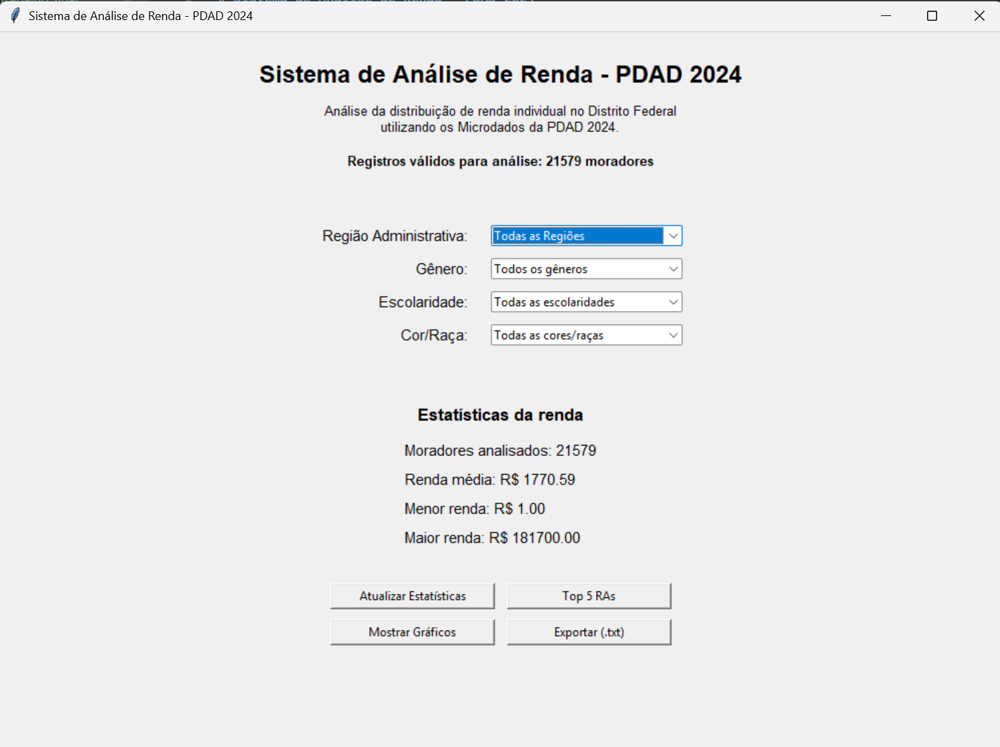

# Sistema de Análise de Renda - PDAD 2024

## Descrição

Este projeto foi desenvolvido para a disciplina **Algoritmos e Programação de Computadores (APC)** da Universidade de Brasília (UnB).

O sistema realiza análises da renda individual utilizando os microdados da **Pesquisa Distrital por Amostra de Domicílios (PDAD 2024)**. Por meio de uma interface gráfica, o usuário pode aplicar filtros, visualizar estatísticas, gerar gráficos, consultar o ranking das Regiões Administrativas com maior renda média e exportar os resultados para um arquivo de texto.

---

## Objetivos

- Manipular dados utilizando a biblioteca **Pandas**;
- Desenvolver uma interface gráfica utilizando **Tkinter**;
- Implementar algoritmos de ordenação manual (Bubble Sort);
- Gerar gráficos utilizando **Matplotlib**;
- Aplicar conceitos de modularização e organização de código em Python.

---

## Interface 💻 

<p style="text-align: center;">
  
</p>

---


## Funcionalidades

O sistema possui as seguintes funcionalidades:

- Carregamento dos microdados da PDAD 2024;
- Filtragem por:
  - Região Administrativa;
  - Gênero;
  - Escolaridade;
  - Cor/Raça;
- Atualização das estatísticas conforme os filtros escolhidos;
- Exibição de:
  - Quantidade de moradores analisados;
  - Renda média;
  - Menor renda positiva;
  - Maior renda declarada;
- Geração de gráficos da distribuição da renda e da renda média por escolaridade;
- Ranking das cinco Regiões Administrativas com maior renda média utilizando **Bubble Sort**;
- Exportação das estatísticas em arquivo `.txt`.

---

# Funcionamento do sistema

Ao iniciar o programa, todos os filtros permanecem configurados para considerar toda a base de dados da PDAD 2024.

Os filtros disponíveis são:

- Região Administrativa;
- Gênero;
- Escolaridade;
- Cor/Raça.

Após selecionar os filtros desejados, o usuário pode utilizar os seguintes botões.

## Atualizar Estatísticas

Aplica os filtros selecionados e recalcula automaticamente:

- Quantidade de moradores analisados;
- Renda média;
- Menor renda positiva;
- Maior renda declarada.

Quando nenhum filtro é aplicado, as estatísticas representam toda a base de dados.

---

## Mostrar Gráficos

Abre uma nova janela contendo dois gráficos produzidos com a biblioteca **Matplotlib**.

São exibidos:

- Histograma da distribuição da renda individual;
- Gráfico de barras da renda média por escolaridade.

Os gráficos sempre utilizam exatamente os mesmos filtros aplicados às estatísticas.

---

## Top 5 RAs

Calcula a renda média de todas as Regiões Administrativas do Distrito Federal e ordena os resultados utilizando o algoritmo **Bubble Sort**, exibindo as cinco regiões com maior renda média.

---

## Exportar (.txt)

Permite salvar as estatísticas calculadas em um arquivo de texto.

O arquivo exportado contém:

- filtros utilizados;
- quantidade de moradores;
- renda média;
- menor renda positiva;
- maior renda declarada.

---

# Estrutura do projeto

```
pdad_trabalho_final/
│
├── dados/
│   └── moradores.csv
│
├── utils/
│   ├── __init__.py
│   ├── carregar.py
│   ├── exportacao.py
│   ├── filtros.py
│   ├── graficos.py
│   ├── interface.py
│   ├── ranking.py
│   └── estatisticas.py
│
├── sistema.py
├── requirements.txt
└── README.md
```

---

# Bibliotecas utilizadas

- pandas
- matplotlib
- tkinter
- pathlib

---

# Instalação

Instale as dependências do projeto utilizando:

```bash
pip install -r requirements.txt
```

---

# Execução

Após instalar as dependências, execute o sistema com:

```bash
python sistema.py
```

---

# Fonte dos dados

Microdados da **Pesquisa Distrital por Amostra de Domicílios (PDAD 2024)**.

---

# Autor

**Emílio de Souza**

Universidade de Brasília (UnB)

Disciplina: Algoritmos e Programação de Computadores (APC)

2026