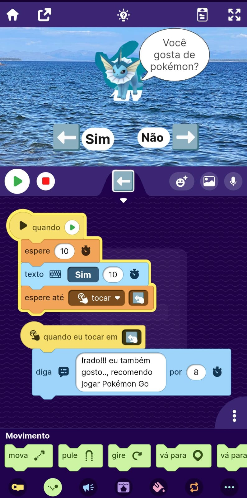
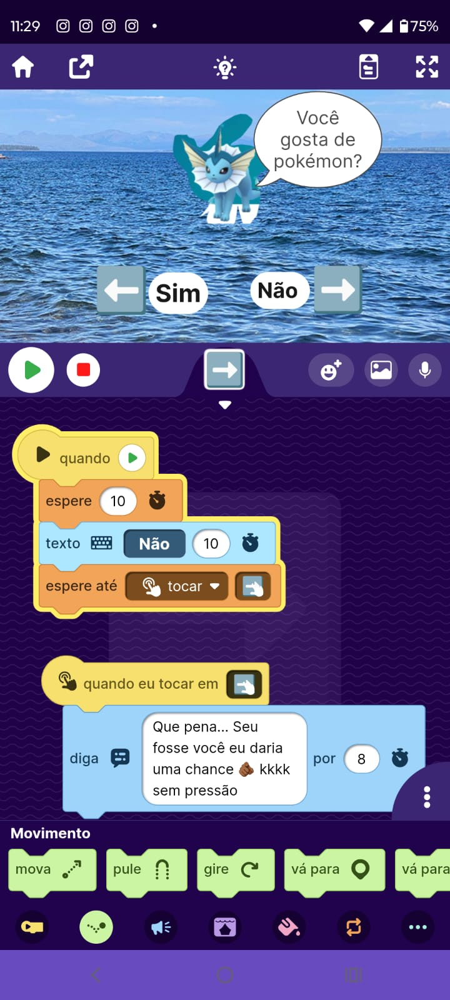

# Semana 01 - Robô algoritmos

## Descrição

Este aqruivo descreve o funcionamento de um algoritmo desenvolvido no simulador OctoStudio.

## Objetivo

Compreender a execução de instruções passo a passo e as funcionalidades do programa.

## Funcionamento

O programa foi desenvolvido com o objetivo de contornar a limitação de interação com o usuário que está presente no OctoStudio, que não permite entrada direta (input).

Como o simulador é mais focado no uso de sensores, foi desenvolvida uma solução alternativa para simular a interação com o usuário de forma simples e criativa, utilizando os recursos disponíveis na plataforma.

### Etapas do Programa

Ao iniciar o programa, o usuário é questionado sobre o seu nome. Devido à limitação do OctoStudio, essa etapa é simulada.

Em seguida, o programa apresenta uma pergunta sobre preferência, como por exemplo se o usuário gosta de Pokémon, oferecendo opções de resposta como "sim" ou "não".

Por fim, o sistema exibe uma mensagem personalizada com base na escolha realizada, simulando uma interação com o usuário.

## Fluxograma

### Início do Programa e pergunta

Nesta etapa, o programa é iniciado com uma pergunta retórica sobre o nome do usuário. Em seguida, o fluxo é direcionado para a pergunta principal, onde ocorre a tomada de decisão.

### Decisão lado 1

Nesta etapa, o fluxo segue pelo caminho correspondente à resposta "sim". Ao selecionar essa opção, o programa apresenta uma mensagem personalizada ao usuário.

### Decisão lado 2

Nesta etapa, o fluxo segue pelo caminho correspondente à resposta "não". Ao selecionar essa opção, o programa apresenta uma mensagem alternativa ao usuário.
