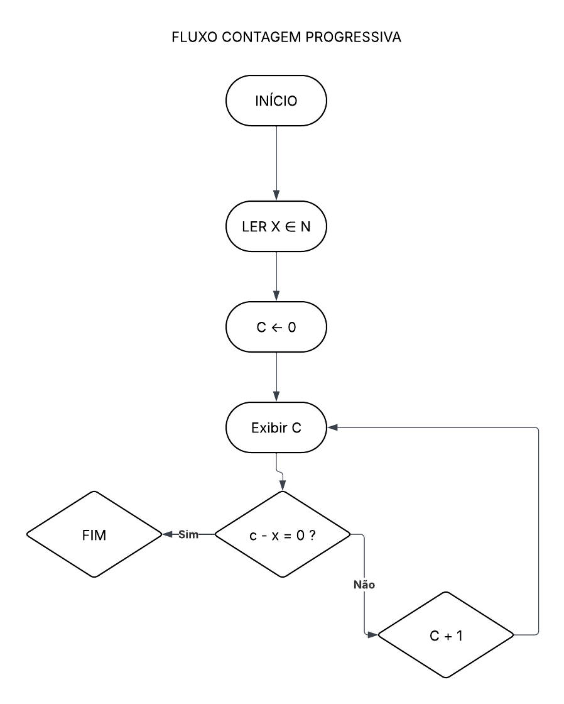

# Programa de contagem Progressiva no LMC

# Descrição

Este programa foi desenvolvido no LMC no intuito de realizar uma contagem progressiva de 0 até o valor X inteiro digitado pelo o usuário.

A cada repetição, o contador é incrementado em uma unidade até atingir o valor informado. Quando o contador se iguala ao número de entrada, o programa é finalizado.


## Fluxo Grama


<p style="text-align: center;">
  
</p>

Este fluxograma mostra o raciocínio matemático do algoritmo, realizando uma contagem de 0 até 
𝑋, adicionando 1 a cada passo e mostrando essa sequência, e parando quando 𝑐 = 𝑋

## Estrutura do Código

- `INP`: recebe o valor digitado pelo usuário  
- `STA X`: armazena o valor informado  
- `LDA ZERO`: carrega o valor inicial (0)  
- `STA CONT`: inicializa o contador  


### Loop de repetição
- `LDA CONT`: carrega o valor atual do contador  
- `OUT`: exibe o valor  
- `SUB X`: compara com o valor informado  
- `BRZ FIM`: finaliza quando o contador é igual ao valor de entrada  


### Incremento
- `LDA CONT`: carrega o valor atual  
- `ADD UM`: soma 1  
- `STA CONT`: atualiza o contador  
- `BRA LOOP`: repete o processo  


## Exemplo de Execução

Entrada:
5

Saída:
0
1
2
3
4
5


## Código

```asm
        INP
        STA X

        LDA ZERO
        STA CONT

LOOP    LDA CONT
        OUT

        SUB X
        BRZ FIM

        LDA CONT
        ADD UM
        STA CONT

        BRA LOOP

FIM     HLT

X       DAT 0
CONT    DAT 0
ZERO    DAT 0
UM      DAT 1