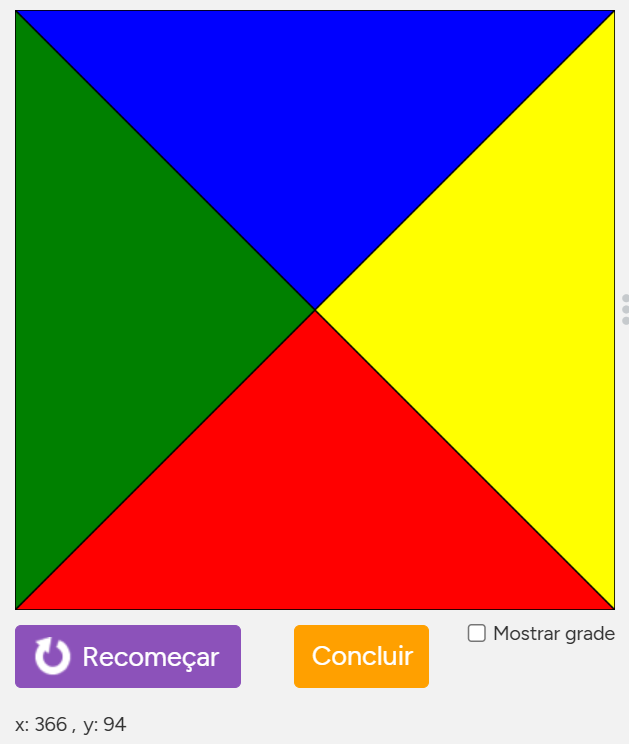
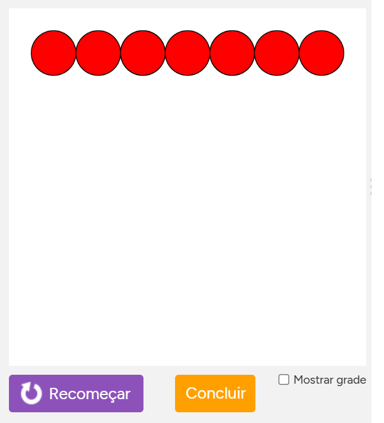
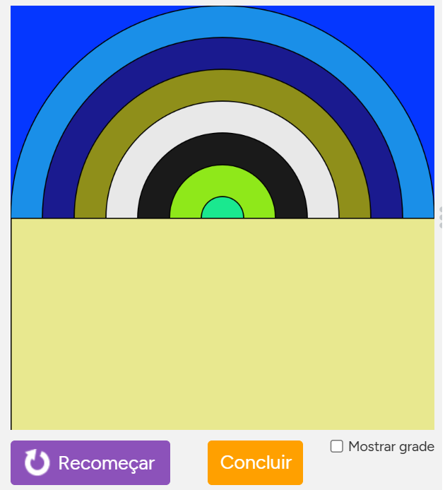
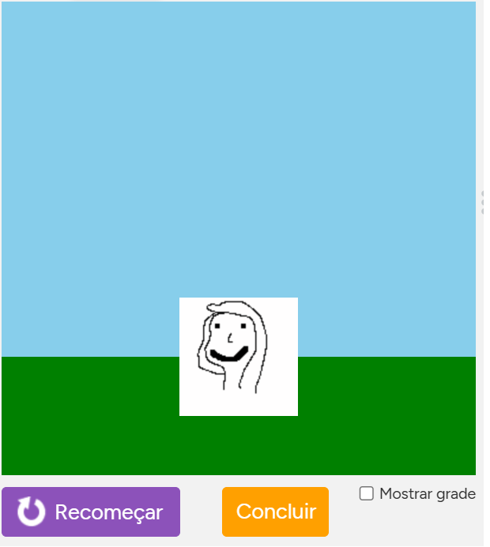
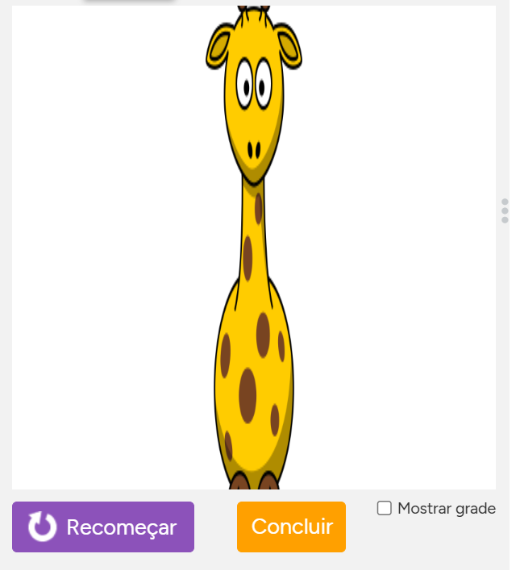

# 📅 Semana 03 -- INTRODUÇÃO AO LABORATÓRIO DE JOGOS 1

Durante esta semana foram desenvolvidas as primeiras atividades na plataforma Code.org, com foco na familiarização com a linguagem de programação JavaScript.

## 📌 Os principais conceitos desenvolvidos incluem:

- Criação de desenhos através de código
- Utilização de formas geométricas e parâmetros
- Introdução ao uso de variáveis
- Geração de números aleatórios
- Criação e manipulação de sprites
- Controle de propriedades dos sprites (posição, velocidade, escala)

Essa etapa foi fundamental para compreender como o código influencia diretamente o comportamento e a aparência dos elementos na tela.

## 🌐 Plataforma utilizada

### Code.org

Link: https://studio.code.org/courses/csd3-virtual/units/1

<p style="text-align: center;">
  
</p>

## 🖼️ Exemplos das atividades

### 🎨 Drawing - Desenhos

Criação de desenhos utilizando código no Game Lab, explorando funções como `rect()`, `ellipse()` e `fill()` para construção de formas geométricas e definição de cores.

<p style="text-align: center;">
  
</p>

### 💻 Trecho de código

Exemplo de construção de um objeto utilizando formas geométricas:

```javascript
fill("dimgray");
fill("red");
rect(100,250);
rect(150,250);
rect(200,250);
rect(250,250);
rect(150,200);
rect(200,200);
fill("gray");
ellipse(150,300);
ellipse(250,300);
```
### 💡 Reflexão Drawing:

foi possível perceber como a combinação de formas simples permite construir elementos visuais mais complexos.

## 🔺Shapes and Parameters - Formas e Parâmetros

Nesta atividade foi explorada a criação de formas personalizadas utilizando a função `shape()`, permitindo a construção de figuras geométricas a partir de coordenadas.

Foram utilizadas diferentes cores com `fill()` e múltiplos pontos para formar triângulos que compõem uma figura completa na tela.

<p style="text-align: center;">
  
</p>

### 💻 Trecho de código

Exemplo de construção da figura utilizando coordenadas para formar triângulos com a função `shape()`, combinando diferentes cores com `fill()`:

```javascript
fill("red");
shape(200, 200, 0, 400, 400, 400);
fill("blue");
shape(200, 200, 0, 0, 400, 0);
fill("yellow");
shape(200, 200, 400, 0, 400, 400);
fill("green");
shape(200, 200, 0, 0, 0, 400);
```
### 💡 Reflexão Shapes and Parameters

foi possível compreender como a definição de coordenadas permite criar formas mais complexas a partir de elementos simples, além de explorar o uso de cores para melhorar a visualização.

#### 🔢 Variables - Váriaveis

Nesta atividade foi explorado o uso de variáveis para controlar a posição de elementos na tela.

As variáveis `x` e `y` foram utilizadas para definir as coordenadas dos círculos, sendo atualizadas ao longo do código para criar padrões visuais, como linhas horizontais, verticais e diagonais.

<p style="text-align: center;">
  
</p>


### 💻 Trecho de código

Exemplo de uso de variáveis para atualizar a posição dos elementos na tela:

```javascript
var x = 50;
var y = 50;

fill("red");
ellipse(x, y);
x = x + 50; 
ellipse(x, y);
x = x + 50; 
ellipse(x, y);
fill("red");
ellipse(x, y);
x = x + 50; 
ellipse(x, y);
x = x + 50; 
ellipse(x, y);
fill("red");
ellipse(x, y);
x = x + 50; 
ellipse(x, y);
x = x + 50; 
ellipse(x, y);
```
### 💡 Reflexão - Variables

Foi possível compreender como a atualização de variáveis permite controlar dinamicamente a posição dos elementos, possibilitando a criação de padrões e repetições de forma mais eficiente.


### 🎲 Random Numbers — Números aleatórios

Nesta atividade foi explorado o uso de números aleatórios para gerar cores dinâmicas na tela.

Foram utilizadas variáveis combinadas com a função `randomNumber()` para definir valores RGB aleatórios, permitindo que as cores dos elementos mudem a cada execução do programa.

<p style="text-align: center;">
  
</p>

### 💻 Trecho de código

Exemplo de geração de cores aleatórias utilizando o modelo RGB:

```javascript
var cor3 = createGroup();
var cor2 = createGroup();
var cor1 = createGroup();
cor2 = randomNumber(0, 255);
cor3 = randomNumber(0, 255);
cor1 = randomNumber(0, 255);
background(rgb(5, 55, 255));
fill(rgb(cor1,cor2,cor3));
ellipse(200, 200, 400, 400);
fill(rgb(cor1,cor1,cor2));
ellipse(200, 200, 340, 340);
fill(rgb(cor2,cor2,cor1));
ellipse(200, 200, 280, 280);
fill(rgb(cor3,cor3,cor3));
ellipse(200, 200, 220, 220);
fill(rgb(cor1,cor1,cor1));
ellipse(200, 200, 160, 160);
fill(rgb(cor2,cor3,cor1));
ellipse(200, 200, 100, 100);
fill(rgb(cor1,cor3,cor2));
ellipse(200, 200, 40, 40);
fill(rgb(cor3, cor3, cor2));
rect(0, 200, 400, 200);
```

### 💡 Reflexão — Random Numbers

Foi possível compreender como a utilização de números aleatórios permite criar comportamentos dinâmicos e imprevisíveis, tornando as aplicações mais interativas e visuais.


### 🎮 Sprites — Criação de personagens

Nesta atividade foi explorado o conceito de sprites, que são objetos utilizados para representar elementos dentro de um jogo.

Foi criado um personagem personalizado utilizando a aba de animação do Game Lab, e posteriormente inserido na cena através da função `createSprite()`.

Além disso, foi possível definir a aparência do sprite com `setAnimation()` e renderizá-lo na tela utilizando `drawSprites()`.

<p style="text-align: center;">
  
</p>

### 💻 Trecho de código

Exemplo de criação e exibição de um sprite:

```javascript
var character = createSprite(200, 300);

background("skyblue");

fill("green");
noStroke();
rect(0, 300, 400, 100);

character.setAnimation("animation_1");

drawSprites();
```

### 💡 Reflexão — Sprites

Foi possível compreender como sprites funcionam como objetos dentro do ambiente gráfico, permitindo a criação de personagens e elementos interativos, sendo uma base essencial para o desenvolvimento de jogos.


### ⚙️ Sprite Properties — Propriedades de sprites

Nesta atividade foram exploradas propriedades que controlam o tamanho e a aparência dos sprites.

Foi possível alterar características como altura (`height`) e escala (`scale`), permitindo modificar o tamanho do sprite diretamente no código, mantendo ou alterando suas proporções.

<p style="text-align: center;">
  
</p>
### 💻 Trecho de código

Exemplo de modificação de propriedades de um sprite:

```javascript
var sprite = createSprite(200, 200);

sprite.setAnimation("giraffe_tall");

sprite.height = 900;
sprite.scale = 0.5;

drawSprites();
```
### 💡 Reflexão — Sprite Properties

Foi possível compreender como a manipulação de propriedades permite alterar diretamente o tamanho e a aparência dos sprites, sendo essencial para ajustar elementos visuais e criar diferentes efeitos em jogos.


## 💡 Reflexão geral da semana

Durante esta semana foi possível compreender conceitos fundamentais de programação, como uso de variáveis, manipulação de coordenadas, geração de números aleatórios e criação de sprites.

Além disso, foi possível perceber como o código influencia diretamente o comportamento visual dos elementos na tela, permitindo a construção de aplicações mais dinâmicas e interativas.