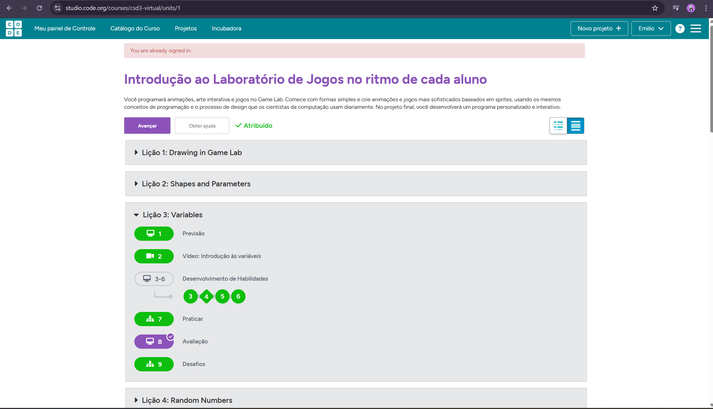
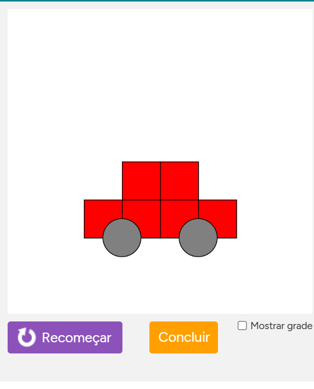

# 📅 Semana 03 -- INTRODUÇÃO AO LABORATÓRIO DE JOGOS 1

Durante esta semana foram desenvolvidas as primeiras atividades na plataforma Code.org, com foco na familiarização com a linguagem de programação JavaScript.

## 📌 Os principais conceitos desenvolvidos incluem:

- Criação de desenhos através de código
- Utilização de formas geométricas e parâmetros
- Introdução ao uso de variáveis
- Geração de números aleatórios
- Criação e manipulação de sprites
- Controle de propriedades dos sprites (posição, velocidade, escala)

Essa etapa foi fundamental para compreender como o código influencia diretamente o comportamento e a aparência dos elementos na tela.

## 🌐 Plataforma utilizada

### Code.org

Link: https://studio.code.org/courses/csd3-virtual/units/1

<p style="text-align: center;">
  
</p>

## 🖼️ Exemplos das atividades

### Drawing -- Desenhos

Criação de desenhos utilizando código no Game Lab, explorando funções como `rect()`, `ellipse()` e `fill()` para construção de formas geométricas e definição de cores.

<p style="text-align: center;">
  
</p>

### 💻 Trecho de código

```javascript
fill("dimgray");
fill("red");
rect(100,250);
rect(150,250);
rect(200,250);
rect(250,250);
rect(150,200);
rect(200,200);
fill("gray");
ellipse(150,300);
ellipse(250,300);