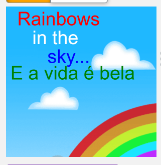
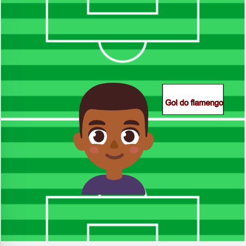
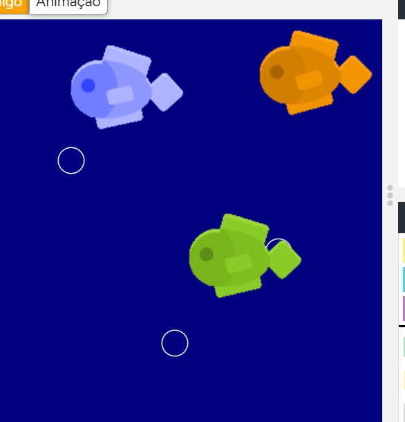
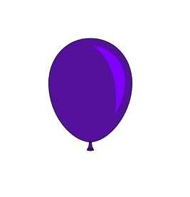
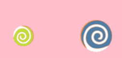
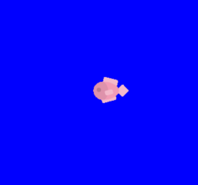
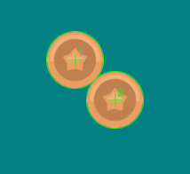

# 📅 Semana 04 — Fundamentos e Entrada de Dados

Durante esta semana foram desenvolvidas atividades no Code.org com foco em conceitos fundamentais da programação em jogos, incluindo lógica condicional, movimentação e interação com o usuário.

## 📌 Conteúdos abordados

- Exibição de textos na tela
- Funcionamento do loop principal (`draw`)
- Movimentação de sprites
- Uso de condicionais
- Entrada de teclado
- Entrada do mouse
- Controle de velocidade
- Detecção de colisões

## 🚀 Desafios concluídos

### 🔤Text - texto

Exibição de informações utilizando a função `text()`, permitindo apresentar mensagens e dados durante a execução do programa.

<p style="text-align: center;">
  
</p>

### 💻 Trecho de código

Exemplo de utilização da função `text()` em conjunto com sprites para composição visual na tela:

```javascript
var sky = createSprite(200,200);
sky.setAnimation("rainbow");
drawSprites();
textSize(50);
fill("red");
text("Rainbows", 30, 50);
fill("white");
text("in the" , 70, 100);
fill("blue");
text("sky...", 110, 150);
fill("green");
text("E a vida é bela", 12, 194);
```
### 💡 Reflexão - text

Foi possível compreender como a função `text()` permite apresentar informações relevantes na tela, contribuindo para a comunicação com o usuário e melhorando a experiência durante a execução.


### 🔁 The Draw Loop - loop principal

Nesta atividade foi explorado o funcionamento da função `draw()`, responsável pela execução contínua do programa, permitindo a atualização dos elementos e a movimentação dos sprites na tela.

<p style="text-align: center;">
  
</p>

### 💻 Exemplo de código

```javascript
var fundo = createSprite(200, 200);
var anime = createSprite(185, 232);
function draw() {
  drawSprites();
  fill("white");
  rect(265, 142, 100, 50);
  fill("black");
  stroke("red");
  textSize(13);
  text("Gol do flamengo", 270, 177);
  anime.setAnimation("eu");
  anime.scale = 0.5;
  fundo.setAnimation("fundo");
  anime.x = randomNumber(185, 190);
  anime.y = randomNumber(232, 240);
}
```

### 💡 Reflexão Draw Loop

Foi possível compreender que a função `draw()` é essencial para a criação de animações e interações dinâmicas, permitindo a atualização constante do estado do programa.


### 🕹️ Sprite Movement - Movimentação de sprites

Nesta atividade foi trabalhada a movimentação de sprites através da alteração de suas posições e propriedades, permitindo criar deslocamentos na tela. Além disso, foi utilizada a função `draw()` para possibilitar a atualização contínua dos elementos, simulando uma animação.

<p style="text-align: center;">
  
</p>

### 💻 Exemplo de código

```javascript
var orangeFish = createSprite(400, randomNumber(0, 110));
orangeFish.setAnimation("orange_fish");
var blueFish = createSprite(250, randomNumber(0, 200));
blueFish.setAnimation("blue_fish");
var greenFish = createSprite(300, randomNumber(200, 300));
greenFish.setAnimation("green_fish");
var buble = 400;
var buble1 = 400;
var buble2 = 400;

function draw() {
  // Draw Background
  background("navy");
  noStroke();
  stroke("white");
  noFill();
  ellipse(200, buble, 25, 25);
  noStroke();
  stroke("white");
  noFill();
  ellipse(100, buble2, 25, 25);
  noStroke();
  stroke("white");
  noFill();
  ellipse(300, buble1, 25, 25);
  
  // Update Values
  if (keyDown("left")) {
    orangeFish.x = orangeFish.x - 2;
    orangeFish.rotation = randomNumber(-3, 3);
    blueFish.x = blueFish.x - 3;
    blueFish.rotation = randomNumber(-3, 3);
    greenFish.x = greenFish.x - 1;
    greenFish.rotation = randomNumber(-3, 3);
  }
  buble1 = buble1 - 2;
  buble2 = buble2 - 3;
  buble = buble - 1;
  
  // Draw Animations
  drawSprites();
}
```

### 💡 Reflexão Sprite Movement

Foi possível perceber que, nesta etapa, os programas passaram a apresentar maior nível de complexidade, envolvendo múltiplos sprites, controle de movimentação, uso de variáveis e atualização contínua através da função `draw()`. Essa evolução demonstra a integração de diferentes conceitos para a construção de cenários mais dinâmicos e interativos.


### 🔀 Conditionals - Condicionais

Nesta etapa foram utilizadas estruturas condicionais (`if`) para controlar o comportamento dos elementos com base em determinadas situações, neste caso quando o balão atingir determinada escala ele irá estourar.

<p style="text-align: center;">
  
</p>

### 💻 Exemplo de código

```javascript
var balloon = createSprite(200, 200);
balloon.setAnimation("balloon");
balloon.scale = 0.1;

function draw() {
  // Draw Background
  background("white");
  
  // Update Values
  balloon.scale = balloon.scale + 0.001;
  if (balloon.scale > 1) {
    balloon.setAnimation("pop");
  }

  // Draw Animations
  drawSprites();
}
```

### 💡 Reflexão Conditionals

O uso de condicionais permitiu implementar regras no programa, tornando o comportamento dos sprites mais dinâmico e inteligente.


### ⌨️ Keyboard and Mouse Input - Entrada de teclado e mouse

Nesta atividade foi explorada a utilização do teclado e do mouse para controlar os movimentos dos sprites em tempo real, utilizando as funções `keyDown()` e `mouseDown()`. À medida que o usuário interage com os botões, o comportamento dos objetos é alterado, modificando sua rotação e escala.

<p style="text-align: center;">
  
</p>

### 💻 Exemplo de código

```javascript
var spiral = createSprite(100,200);
spiral.setAnimation("lollipop");
var spiral2 = createSprite(300,200);
spiral2.setAnimation("lollipop2");
function draw() {
  background("pink");
  if (mouseDown("leftButton")) {
    spiral.scale = spiral.scale  / 1.01;
    spiral.rotation = spiral.rotation + 3;
    spiral2.scale = spiral2.scale  * 1.01;
    spiral2.rotation = spiral2.rotation - 3;
  } else {
    spiral.scale = spiral.scale  * 1.01;
    spiral.rotation = spiral.rotation - 3;
    spiral2.scale = spiral2.scale  / 1.01;
    spiral2.rotation = spiral2.rotation + 3;
  }
  drawSprites();
}
```

### 💡 Reflexão Keyboard and mouse Input

Foi possível compreender como a entrada de dados do usuário através do teclado e mouse permite criar interações diretas com os elementos na tela.


## ⚡ Velocity - Velocidade

Nesta etapa foi introduzido o conceito de velocidade, permitindo controlar o movimento dos sprites de forma mais natural e contínua. Além disso, foram utilizadas estruturas condicionais para impedir que o objeto ultrapasse os limites da tela, mantendo o movimento dentro das extremidades.

<p style="text-align: center;">
  
</p>

### 💻 Exemplo de código

```javascript
var fish = createSprite(200, 200);
fish.setAnimation("fishR");
fish.velocityX = 4;

function draw() {
  background("blue");
  if (fish.x > 400) {
    fish.velocityX = -4;
    fish.setAnimation("fishL");
  }
  
  if (fish.x < 0) {
fish.setAnimation("fishR");
  fish.velocityX = 0;
  }
  if (keyWentDown("right")) {
  fish.velocityX = 4;
  }
  drawSprites();
}
```

### 💡 Reflexão Velocity

Foi possível compreender que o uso de velocidade simplifica a movimentação dos sprites, permitindo criar deslocamentos contínuos e mais naturais. Quando combinado com estruturas condicionais e funções de controle, torna-se essencial para a construção de comportamentos dinâmicos e interativos no programa.


## 💥 Collision Detection - Detecção de colisão

Nesta atividade foi explorada a detecção de colisões entre sprites por meio da função `isTouching()`, permitindo identificar quando dois objetos entram em contato. Além disso, foi utilizado o método `setCollider()` para ajustar a área de colisão dos sprites, tornando a detecção mais precisa de acordo com o formato dos objetos.

<p style="text-align: center;">
  
</p>

### 💻 Exemplo de código

```javascript
var coin1 = createSprite(100, 100);
coin1.setCollider("circle");
coin1.setAnimation("bronze_coin");
coin1.velocityX = 1;
coin1.velocityY = 1;

coin1.debug=true;
var coin2 = createSprite(300, 300);
coin2.setCollider("circle");
coin2.setAnimation("bronze_coin");
coin2.velocityX = -1;
coin2.velocityY = -1;

coin2.debug=true;
function draw() {
  background("teal");
  if (coin1.isTouching(coin2)) {
    coin1.velocityX = 0;
    coin1.velocityY = 0;
    coin2.velocityX = 0;
    coin2.velocityY = 0;
  }
  drawSprites();
}
```

### 💡 Reflexão Collision Detection

Foi possível compreender como a detecção de colisões é essencial para criar interações entre objetos, como perda de vida, ganho de pontos ou eventos no jogo.

## 🧠 Conclusão

Durante esta semana foi possível consolidar conceitos fundamentais da programação de jogos, integrando lógica condicional, movimentação, entrada de dados e detecção de colisões.