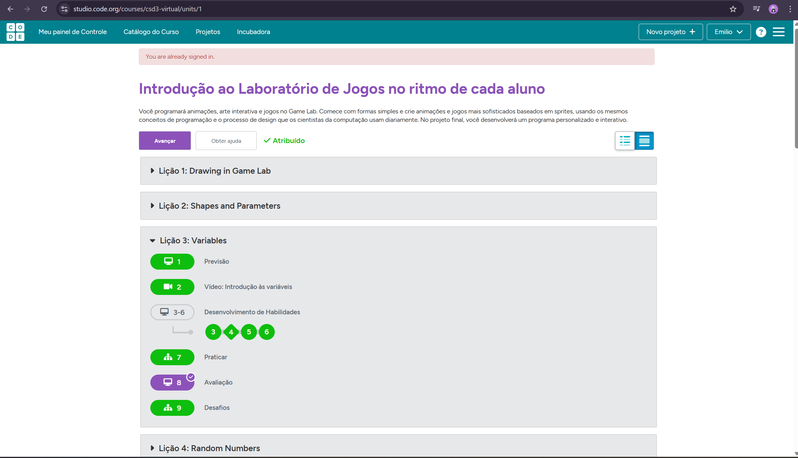
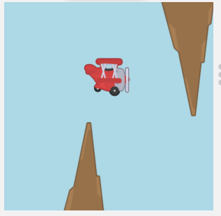
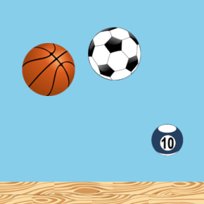
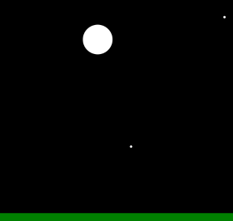

# 📅 Semana 05 — Movimentação Avançada e Organização do Código

Durante esta semana foram desenvolvidas atividades mais avançadas no Code.org, aprofundando conceitos relacionados à movimentação complexa de sprites, colisões entre objetos e utilização de funções para organização e reutilização do código.

## 📌 Conteúdos abordados

- Movimentação complexa de sprites
- Colisões entre múltiplos objetos
- Utilização de funções
- Organização e reutilização de código
- Criação de cenários dinâmicos
- Controle de obstáculos e pontuação
- Estruturação de jogos simples

## 🌐 Plataforma utilizada

### Code.org

Link: https://studio.code.org/courses/csd3-virtual/units/1

<p style="text-align: center;">
  
</p>

## 🚀 Desafios concluídos

## 🎮 Complex Sprite Movement - Movimentação Complexa

Nesta atividade fooi utilizado sprite com velocidade e comportamentos diferentes, permitindo traçar um trajto para o avião para passar nos espaços nescessários

<p style="text-align: center;">
  
</p>

### 💻 Exemplo de código

```javascript
var plane = createSprite(50, 350);
plane.setAnimation("plane");
var rock = createSprite(150, 350);
rock.setAnimation("rock");
var rockdown = createSprite(350, 100);
rockdown.setAnimation("rock_down");

plane.velocityY = -9;
plane.velocityX = 3;

function draw() {
  background("lightblue");
  
  plane.velocityY = plane.velocityY + 0.2;
  
  drawSprites();
}
```

### 💡 Reflexão Complex Sprite Movement

Foi possível perceber uma evolução significativa na complexidade dos programas, integrando movimentação contínua, gravidade, múltiplos objetos e interação em tempo real. Os projetos começaram a se aproximar mais da estrutura de jogos completos.


## 💥 Collisions - Colisões

Nesta atividade foram exploradas diferentes formas de interação entre sprites através de colisões, utilizando funções como `isTouching()`, ` bounceoff`, `displace()` entre outras para fazer o movimento das bolas

<p style="text-align: center;">
  
</p>

### 💻 Exemplo de código

```javascript
var basketball = createSprite(100, 0);
basketball.setAnimation("basketball");
basketball.bounciness = 0.8;

var soccerball = createSprite(225, 0);
soccerball.setAnimation("soccerball");
soccerball.bounciness = 0.9;

var poolball = createSprite(325, 0);
poolball.setAnimation("poolball");
poolball.bounciness = 0.4;

var wood = createSprite(200, 375);
wood.setAnimation("floor");


function draw() {
  background("skyblue");
  
  basketball.bounceOff(wood);
  soccerball.bounceOff(wood);
  poolball.bounceOff(wood);
  
  basketball.velocityY = basketball.velocityY + 0.2;
  soccerball.velocityY = soccerball.velocityY + 0.2;
  poolball.velocityY = poolball.velocityY + 0.2;
  
  drawSprites();
}
```

### 💡 Reflexão Collisions

Foi possível compreender como colisões tornam os jogos mais interativos e desafiadores, permitindo criar obstáculos, sistemas de pontuação e diferentes tipos de eventos durante a execução.

---

## 🧩 Functions - Funções

Nesta etapa foram utilizadas funções para organizar melhor o código, separando partes específicas do programa em blocos reutilizáveis. Isso facilitou a leitura, manutenção e desenvolvimento de cenários mais complexos.

<p style="text-align: center;">
  
</p>

### 💻 Exemplo de código

```javascript
var pos1;
var pos2;
pos1 = 25;
pos2 = 70;
function draw() {
  if(World.mouseY > 200){
    drawScene1();
  } else {
    drawScene2();
  }
}
function drawScene1() {
  background("lightblue");
  fill("green");
  rect(0, 370, 400, 100);
  fill("yellow");
  ellipse(pos1, pos2, 50, 50);
  pos1 = pos1 + 2;
  pos2 = pos2 + 0.2;
  if (pos1 > 400) {
    pos1 = 25;
    pos2 = 70;
  }
}
function drawScene2() {
  background("black");
  fill("green");
  rect(0, 370, 400, 100);
  fill("white");
  ellipse(pos1, pos2, 50, 50);
  ellipse(randomNumber(0, 400), randomNumber(0, 400), 5, 5);
  ellipse(randomNumber(0, 400), randomNumber(0, 400), 5, 5);
  ellipse(randomNumber(0, 400), randomNumber(0, 400), 5, 5);
  ellipse(randomNumber(0, 400), randomNumber(0, 400), 5, 5);
  pos1 = pos1 + 2;
  pos2 = pos2 + 0.2;
  if (pos1 > 400) {
    pos1 = 25;
    pos2 = 70;
  }
}
```

### 💡 Reflexão Functions

O uso de funções tornou o código mais organizado e reutilizável, permitindo dividir problemas maiores em partes menores.
