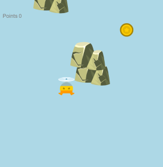
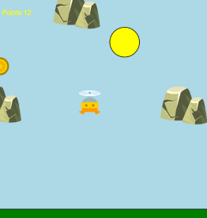
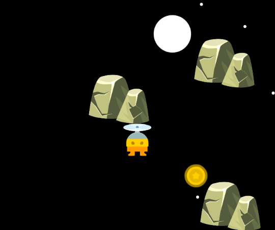
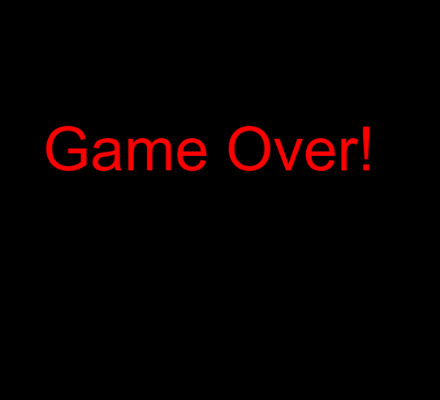

# 🎮 Semana 06 — Projeto Final code.org

Durante esta etapa foi desenvolvido um jogo completo no Code.org utilizando os principais conceitos aprendidos ao longo das semanas anteriores.

O objetivo do jogo é controlar o personagem, coletar moedas e evitar obstáculos para continuar sobrevivendo e aumentar a pontuação o máximo que conseguir.

Nome do Jogo: Show de pedra !!! (Assim que jogar, saberá o porque...)
---

## 📌 Conceitos utilizados

- Movimentação de sprites
- Gravidade
- Colisões entre objetos
- Controle por teclado
- Sistema de pontuação
- Geração aleatória de obstáculos
- Funções para organização do código
- Mudança dinâmica de cenário
- Condições de derrota

---

## 🌐 Plataforma utilizada

### Code.org

Link: https://studio.code.org/courses/csd3-virtual/units/1

<p style="text-align: center;">
  
</p>

---

# 🕹️ Funcionamento do jogo

O jogador controla um personagem que deve desviar de obstáculos enquanto coleta moedas para aumentar sua pontuação.

À medida que a pontuação aumenta, o cenário do jogo muda, tornando a experiência mais dinâmica visualmente.

Caso o jogador saia dos limites da tela, o jogo termina exibindo a mensagem de Game Over.

---

## 📸 Imagens do projeto

### Tela inicial

<p style="text-align: center;">
  
</p>

### Mudança de cenário

<p style="text-align: center;">
  
</p>

---

### Mudança do cenário


<p style="text-align: center;">
  
</p>


### Game Over

<p style="text-align: center;">
  
</p>

---

# 💻 Trecho de código

Exemplo da lógica principal utilizada no projeto:

```javascript
// queda do jogador
player.velocityY = player.velocityY + 0.5;

// controles do jogador
if (keyDown("up")) {
  player.velocityY = -5;
}

if (keyDown("left")) {
  player.velocityX = -3;
}

if (keyDown("right")) {
  player.velocityX = +3;
}

// colisão com moedas
if (din.isTouching(player)) {
  points = points + 1;
  din.y = randomNumber(0, 400);
  din.x = randomNumber(0, 400);
}
```

---

# 🧩 Estrutura do código

O projeto foi dividido utilizando funções para facilitar a organização e reutilização do código.

As funções `fundo2()` e `fundo3()` foram utilizadas para criar cenários diferentes conforme a pontuação do jogador aumenta.

```javascript
function fundo3() {
  background("black");
  fill("green");
  rect(0, 370, 400, 100);
  fill("white");
  ellipse(pos1, pos2, 50, 50);
  ellipse(randomNumber(0, 400), randomNumber(0, 400), 5, 5);
  ellipse(randomNumber(0, 400), randomNumber(0, 400), 5, 5);
  ellipse(randomNumber(0, 400), randomNumber(0, 400), 5, 5);
  ellipse(randomNumber(0, 400), randomNumber(0, 400), 5, 5);
  pos1 = pos1 + 2;
  pos2 = pos2 + 0.2;
  if (pos1 > 400) {
    pos1 = 25;
    pos2 = 70;
  }
}
```
Cúriosidade: Essas ellipse com números randômicos é para simular as estrelas nesse cenário 

### Testando o jogo

O jogo está disponivel na plataforma code.org. Caso tenha interesse de testar acesse os links disponibilizados abaixo

link: https://studio.code.org/projects/gamelab/8208a85b-28c3-4319-9289-3a68863d63b2
link: https://studio.code.org/projects/gamelab/81a2d95a-6aa8-43c1-a1fe-2797caad47cc
---

