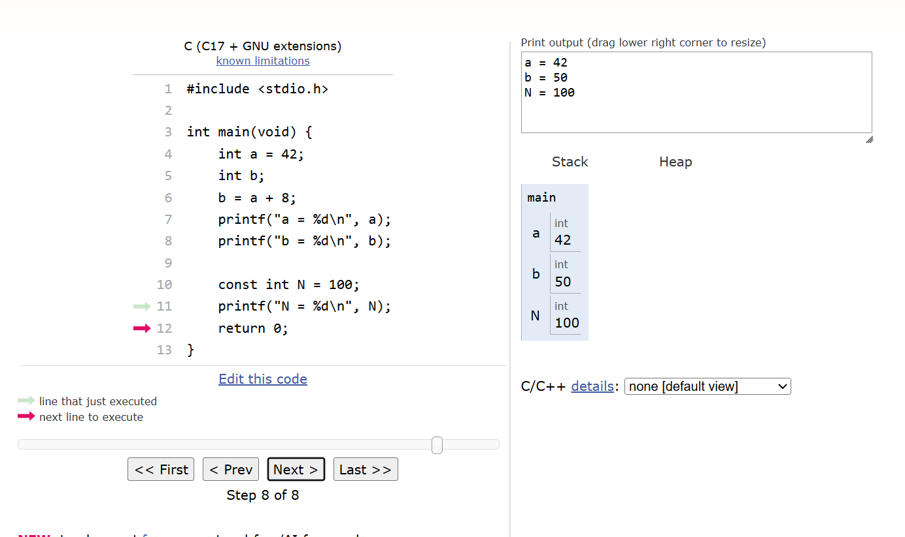

# 📅 Semana 07 — Introdução à Linguagem C

Durante esta semana foi realizado o primeiro contato com a linguagem C utilizando o Python Tutor para visualizar e compreender a execução dos programas passo a passo. Os exercícios abordaram conceitos fundamentais da estrutura de um programa em C, incluindo a função principal, variáveis e saída de dados na tela.

## 📌 Conteúdos abordados

- Introdução à linguagem C
- Estrutura básica de um programa
- Função `main()`
- Declaração de variáveis
- Uso do `printf()`
- Tipos de dados básicos
- Execução passo a passo com Python Tutor

## 🌐 Plataforma utilizada

### Python Tutor

Link: https://pythontutor.com/

<p style="text-align: center;">
  
</p>

---

## 🚀 Exercícios desenvolvidos

## 💻 Estrutura básica em C

Nesta atividade foi explorada a estrutura principal de um programa em C, compreendendo onde o código se inicia e como as instruções são organizadas dentro da função `main()`.


### 💻 Exemplo de código

```c
#include <stdio.h>

int main() {

    printf("Olá Mundo!");

    return 0;
}
```

### 💡 Reflexão Estrutura Básica

Foi possível compreender como funciona a base de um programa em C e a importância da função `main()` como ponto inicial da execução.

---

## 🔢 Variáveis em C

Nesta etapa foram utilizadas variáveis para armazenar valores numéricos e manipular informações dentro do programa.

<p style="text-align: center;">
  
</p>

### 💻 Exemplo de código

```c
#include <stdio.h>

int main(void) {
    int a = 42;
    int b;      
    b = a + 8;
    printf("a = %d\n", a);
    printf("b = %d\n", b);

    const int N = 100;
    printf("N = %d\n", N);
    return 0;
}
```

### 💡 Reflexão Variáveis

Os exercícios ajudaram a entender melhor como os dados podem ser armazenados e utilizados durante a execução do programa, mostrando a importância das variáveis na programação.
