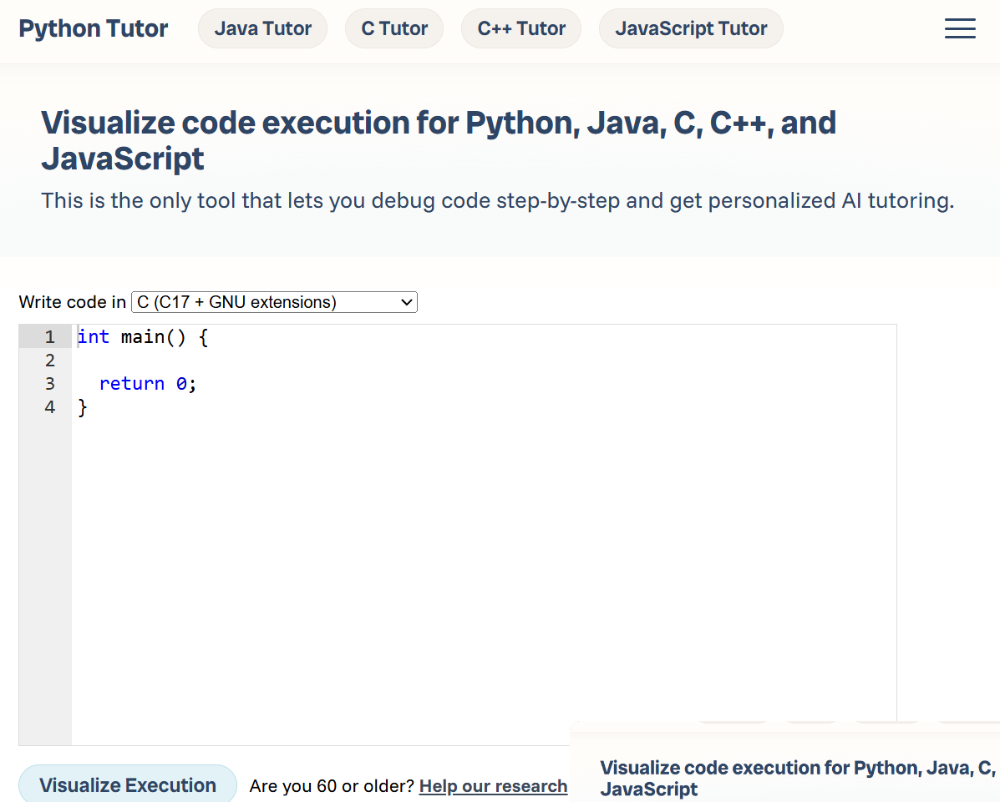
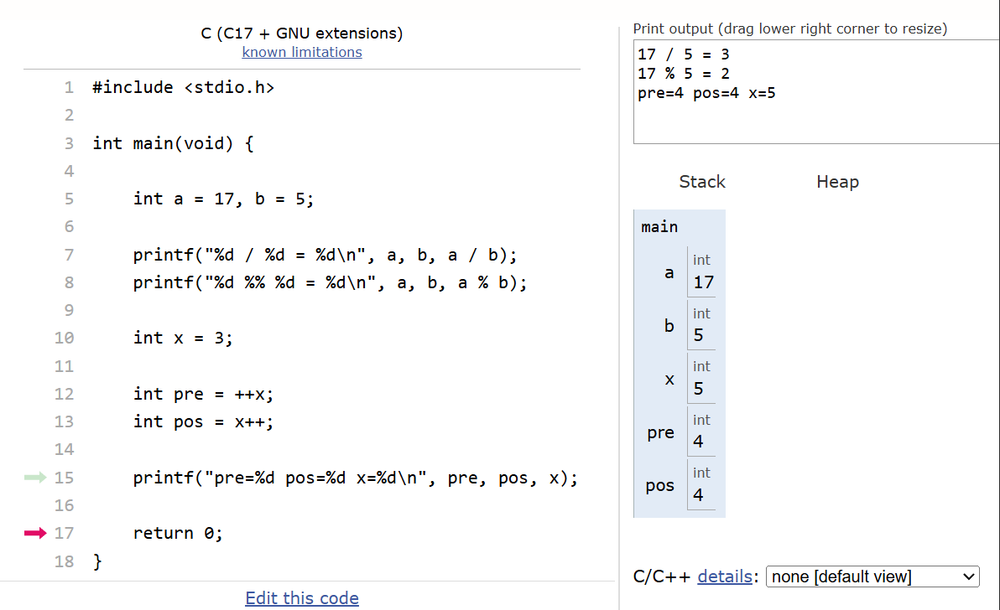
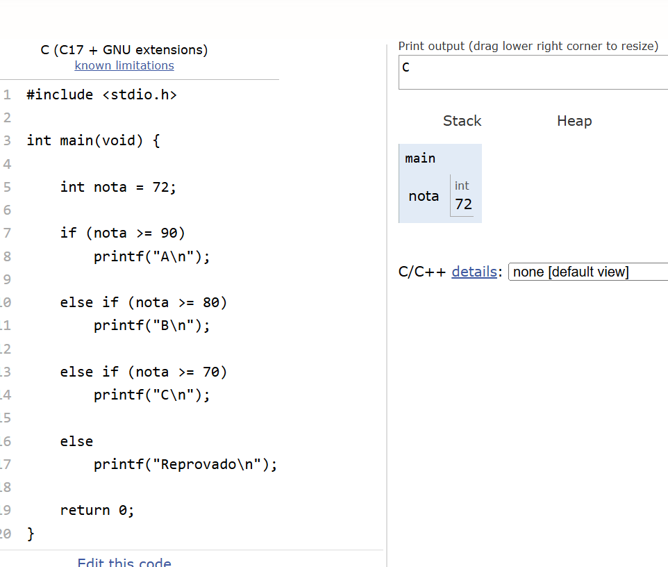
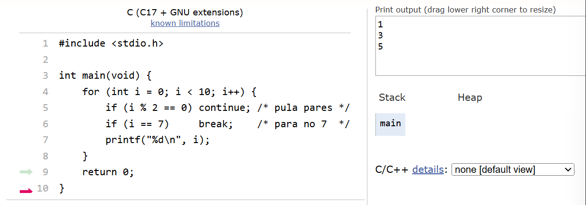

# 📅 Semana 08 — Operadores e Controle de Fluxo em C

Durante esta semana foram aprofundados conceitos fundamentais da linguagem C relacionados aos operadores e estruturas de controle de fluxo. Os exercícios ajudaram a compreender melhor como realizar operações matemáticas, comparações lógicas e controlar a execução do programa através de condicionais e laços de repetição.

## 📌 Conteúdos abordados

- Operadores aritméticos
- Operadores relacionais
- Operadores lógicos
- Incremento e decremento
- Operador ternário
- Estruturas condicionais (`if`, `else if`, `else`)
- Estrutura `switch`
- Laços de repetição (`for`, `while`, `do while`)
- Uso de `break` e `continue`

## 🌐 Plataforma utilizada

### Python Tutor

Link: https://pythontutor.com/

<p style="text-align: center;">
  
</p>

---

## 🚀 Exercícios desenvolvidos

## ➗ Operadores em C

Nesta atividade foram explorados diferentes tipos de operadores da linguagem C, incluindo operações matemáticas, comparações e incremento de variáveis.

<p style="text-align: center;">
  
</p>

### 💻 Exemplo de código

```c
#include <stdio.h>

int main(void) {

    int a = 17, b = 5;

    printf("%d / %d = %d\n", a, b, a / b);
    printf("%d %% %d = %d\n", a, b, a % b);

    int x = 3;

    int pre = ++x;
    int pos = x++;

    printf("pre=%d pos=%d x=%d\n", pre, pos, x);

    return 0;
}
```

### 💡 Reflexão Operadores

Os exercícios ajudaram a entender melhor como a linguagem C realiza operações matemáticas e manipula valores dentro das variáveis, principalmente nas diferenças entre pré e pós incremento.

---

## 🔀 Controle de Fluxo

Nesta etapa foram utilizadas estruturas condicionais e laços de repetição para controlar diferentes caminhos de execução dentro do programa.

<p style="text-align: center;">
  
</p>

### 💻 Exemplo de código

```c
#include <stdio.h>

int main(void) {

    int nota = 72;

    if (nota >= 90)
        printf("A\n");

    else if (nota >= 80)
        printf("B\n");

    else if (nota >= 70)
        printf("C\n");

    else
        printf("Reprovado\n");

    return 0;
}
```

### 💡 Reflexão Controle de Fluxo

Assim conseguimos que o programa siga fluxos diferentes apenas com o resultado dos dados algo de extrema importância para fazer programas mais complexos 

---

## 🔁 Estruturas de repetição

Durante os exercícios também foram explorados laços de repetição utilizando `for`, além do uso de `break` e `continue` para controlar o fluxo de execução.

<p style="text-align: center;">
  
</p>

### 💻 Exemplo de código

```c
#include <stdio.h>

int main(void) {

    for (int i = 0; i < 10; i++) {

        if (i % 2 == 0)
            continue;

        if (i == 7)
            break;

        printf("%d\n", i);
    }

    return 0;
}
```

### 💡 Reflexão Estruturas de repetição

Os laços mostraram como automatizar tarefas repetitivas dentro do programa, tornando o código mais eficiente e reduzindo a necessidade de repetir instruções manualmente.

---

## 🧠 Conclusão

Nesta semana foi possível aprofundar conceitos importantes da linguagem C relacionados a operadores e controle de fluxo. Os exercícios ajudaram a compreender melhor como os programas realizam cálculos, tomam decisões e executam repetições de maneira estruturada.