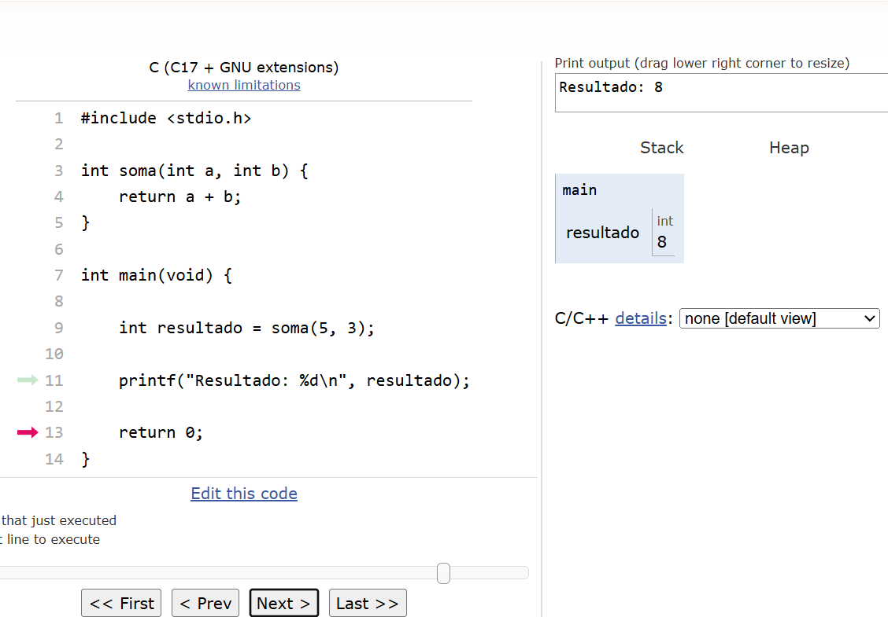
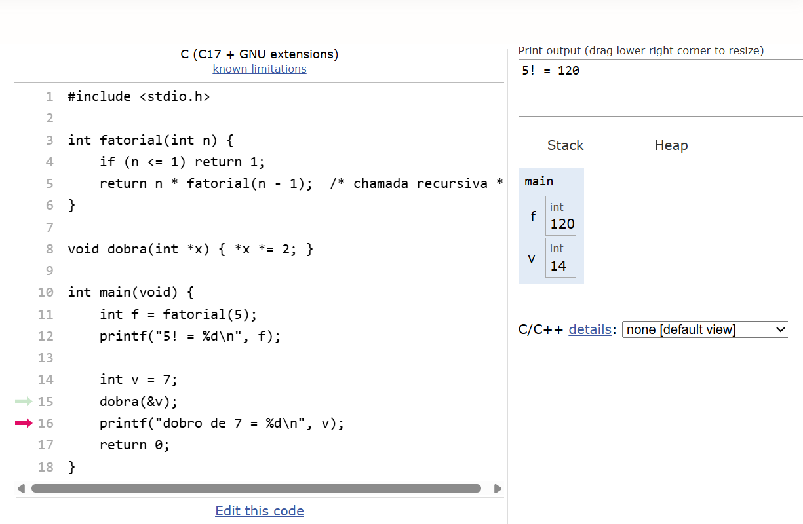

# 📅 Semana 09 — Funções, Pilha de Chamada e Arrays

Durante esta semana foram estudados conceitos importantes da linguagem C relacionados à modularização do código através de funções, funcionamento da pilha de chamadas e utilização de arrays para armazenamento de múltiplos valores.

## 📌 Conteúdos abordados

- Criação e utilização de funções
- Funcionamento da pilha de chamadas
- Organização modular do código
- Manipulação de múltiplos dados

## 🌐 Plataforma utilizada

### Python Tutor

Link: https://pythontutor.com/

<p style="text-align: center;">
  
</p>

---

## 🚀 Exercícios desenvolvidos

## 🧩 Functions - Funções

Nesta atividade foram utilizadas funções para dividir o programa em partes menores e reutilizáveis, facilitando a organização e compreensão do código.

<p style="text-align: center;">
  
</p>

### 💻 Exemplo de código

```c
#include <stdio.h>

int soma(int a, int b) {
    return a + b;
}

int main(void) {

    int resultado = soma(5, 3);

    printf("Resultado: %d\n", resultado);

    return 0;
}
```

### 💡 Reflexão Functions - Funçõe

O uso de funções mostrou como dividir problemas maiores em partes menores facilita a leitura e organização do programa, além de permitir reutilizar código em diferentes situações.

---

## 📚 Call Stack - Pilha de chamada

Nesta etapa foi explorado o funcionamento da pilha de chamadas, observando como as funções são executadas e removidas da memória durante a execução do programa.

<p style="text-align: center;">
  
</p>

### 💻 Exemplo de código

```c
#include <stdio.h>

int fatorial(int n) {
    if (n <= 1) return 1;
    return n * fatorial(n - 1);  /* chamada recursiva */
}

void dobra(int *x) { *x *= 2; }

int main(void) {
    int f = fatorial(5);
    printf("5! = %d\n", f);

    int v = 7;
    dobra(&v);
    printf("dobro de 7 = %d\n", v);
    return 0;
}
```

### 💡 Reflexão Call Stack

Visualizar a pilha de chamadas ajudou a compreender melhor como o programa organiza a execução das funções e como cada chamada é armazenada temporariamente na memória.


---

## 🧠 Conclusão

Nesta semana foi possível compreender melhor como funções, pilha de chamadas contribuem para a organização e funcionamento interno dos programas em C. Os exercícios ajudaram a reforçar conceitos importantes relacionados à modularização do código e manipulação de dados.

Com isso, foi possível encerrar os conteúdos introdutórios da linguagem C com uma base mais sólida sobre lógica, estruturas e funcionamento dos programas. Os conhecimentos adquiridos ao longo dessas semanas servirão como fundamento importante para o próximo passo da disciplina, que será o início dos estudos utilizando Python.