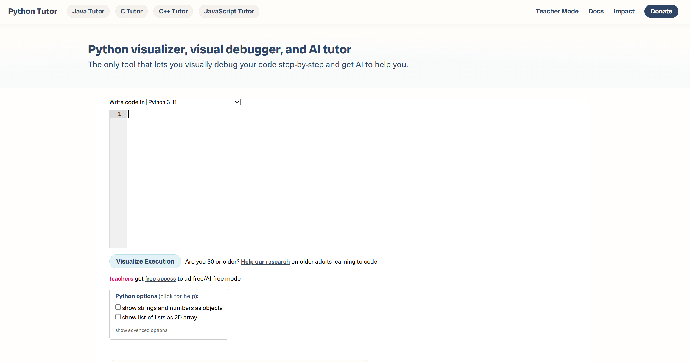
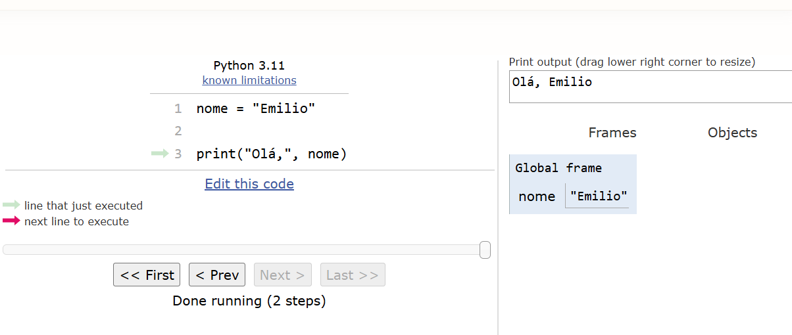
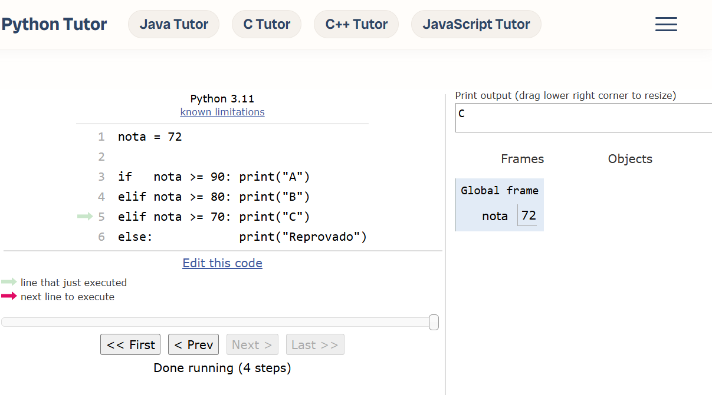
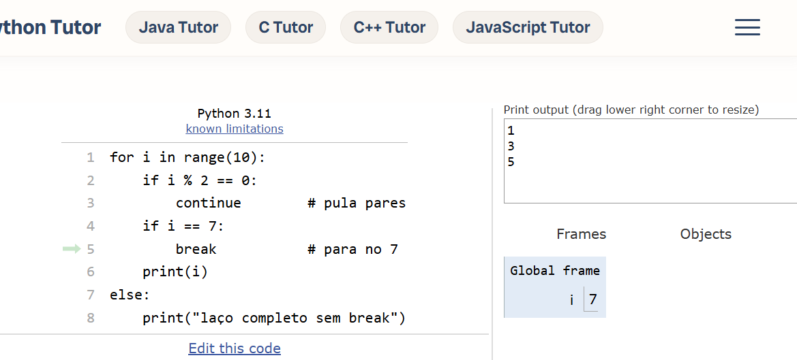
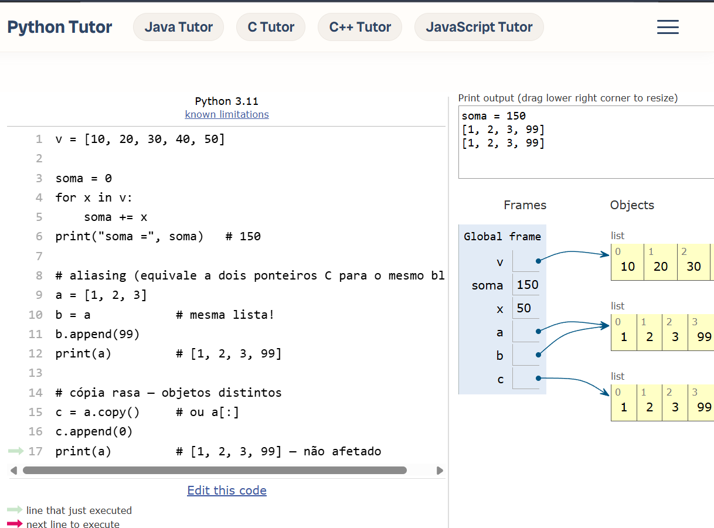

# 📅 Semana 10 — Introdução ao Python

Durante esta semana foi iniciado o estudo da linguagem Python. Os exercícios tiveram como foco a comparação entre conceitos já estudados em C e suas equivalências em Python, permitindo compreender as diferenças de sintaxe e a forma como a linguagem organiza os programas.

## 📌 Conteúdos abordados

- Introdução à linguagem Python
- Diferenças entre Python e C
- Variáveis e atribuições
- Estruturas condicionais (`if`, `elif`, `else`)
- Estruturas de repetição (`for` e `while`)
- Funções em Python
- Importação de módulos
- Referências a objetos
- Listas

## 🌐 Plataforma utilizada

### Python Tutor

Link: https://pythontutor.com/

<p style="text-align: center;">
  
</p>

---

## 🚀 Exercícios desenvolvidos

## 🐍 Sintaxe básica em Python

Nesta atividade foram exploradas as principais diferenças entre a sintaxe de C e Python, observando como estruturas equivalentes podem ser escritas de forma mais simples.

<p style="text-align: center;">
  
</p>

### 💻 Exemplo de código

```python
nome = "Emilio"

print("Olá,", nome)
```

### 💡 Reflexão Sintaxe

Foi possível perceber que Python possui uma sintaxe mais enxuta e legível quando comparada ao C, eliminando a necessidade de diversos elementos obrigatórios presentes em linguagens compiladas.

---

## 🔀 Estruturas condicionais

Nesta etapa foram estudadas as estruturas de decisão utilizando `if`, `elif` e `else`, equivalentes aos comandos condicionais utilizados anteriormente em C.

<p style="text-align: center;">
  
</p>

### 💻 Exemplo de código

```python
nota = 72

if   nota >= 90: print("A")
elif nota >= 80: print("B")
elif nota >= 70: print("C")
else:            print("Reprovado")
```

### 💡 Reflexão Condicionais

As estruturas condicionais apresentaram funcionamento semelhante ao observado em C, porém com uma sintaxe mais simples e baseada em indentação.

---

## 🔁 Estruturas de repetição

Foram explorados os laços de repetição utilizando `for` e `while`, observando as diferenças em relação às estruturas utilizadas anteriormente em C.

<p style="text-align: center;">
  
</p>

### 💻 Exemplo de código

```python
for i in range(10):
    if i % 2 == 0:
        continue        # pula pares
    if i == 7:
        break           # para no 7
    print(i)
else:
    print("laço completo sem break")
```

### 💡 Reflexão Estruturas de repetição

O uso do `range()` tornou os laços mais simples de escrever e compreender, mantendo a mesma lógica já estudada anteriormente.

---

## 📚 Listas e referências

Nesta atividade foi possível compreender que variáveis em Python armazenam referências para objetos, além de explorar o funcionamento das listas.

<p style="text-align: center;">
  
</p>

### 💻 Exemplo de código

```python
v = [10, 20, 30, 40, 50]

soma = 0
for x in v:
    soma += x
print("soma =", soma)   # 150

# aliasing (equivale a dois ponteiros C para o mesmo bloco)
a = [1, 2, 3]
b = a            # mesma lista!
b.append(99)
print(a)         # [1, 2, 3, 99]

# cópia rasa — objetos distintos
c = a.copy()     # ou a[:]
c.append(0)
print(a)         # [1, 2, 3, 99] — não afetado
```

### 💡 Reflexão Listas

Os exercícios mostraram que múltiplas variáveis podem apontar para o mesmo objeto em memória, comportamento diferente do que normalmente foi observado durante os estudos iniciais em C.

---

## 🧠 Conclusão

Nesta semana foi iniciado o estudo da linguagem Python, utilizando como base os conhecimentos adquiridos anteriormente em C. Foi possível perceber que muitos conceitos permanecem os mesmos, porém com uma sintaxe mais simples e focada na legibilidade. A transição mostrou como a base construída ao longo das semanas anteriores facilita o aprendizado de uma nova linguagem de programação.