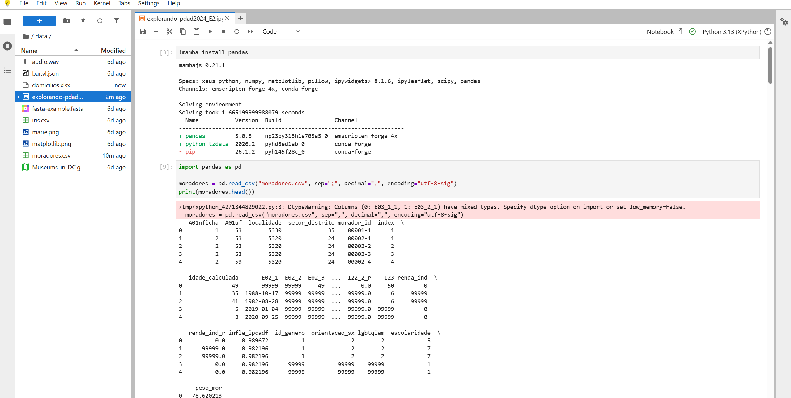

# 📅 Semana 11 — Introdução à Análise de Dados com Python

Durante esta semana iniciamos o trabalho com os Microdados da PDAD 2024 utilizando a linguagem Python e a plataforma Jupyter Notebook. Foram apresentados os conceitos básicos para manipulação e análise de dados, além da estrutura do ambiente de desenvolvimento utilizado ao longo das próximas atividades.

## 📌 Conteúdos abordados

- Introdução ao Jupyter Notebook
- Introdução aos Microdados da PDAD 2024
- Utilização de Python para análise de dados
- Estrutura de bases de dados
- Exploração inicial de conjuntos de dadoss

## 🌐 Plataforma utilizada

### Jupyter Notebook

  

---

## ⚠️ Problemas encontrados no ambiente

Durante as atividades foram encontradas algumas limitações relacionadas ao ambiente Jupyter Notebook utilizado em aula. Em determinados momentos houve incompatibilidade entre versões de bibliotecas, especialmente do Pandas, o que impediu a execução de alguns exemplos exatamente como apresentados no material.

Além disso, o ambiente possui restrições na instalação e atualização de pacotes, exigindo adaptações para que algumas atividades pudessem ser executadas corretamente.

## 🚀 Exercícios desenvolvidos

Nesta semana foram realizados exercícios com os Microdados da PDAD 2024 até o item **2.4**, avançando da leitura inicial dos dados para filtros e cálculos básicos com Python e Pandas.

### 📌 Exercícios realizados

- **1.1 — Lendo os dados:** carregamento da tabela de moradores com `read_csv()` e visualização inicial com `head()`.
- **1.2 — Selecionando colunas:** escolha de colunas específicas para análise.
- **1.3 — Contando moradores por domicílio:** leitura da tabela de domicílios e uso de iteração.
- **1.4 — Exibindo idades:** filtragem de valores especiais, como `99999`.
- **2.1 — Calculando a idade média:** cálculo manual da média usando `for`.
- **2.2 — Contando por escolaridade:** uso de dicionários para organizar contagens.
- **2.3 — Filtrando por Região Administrativa:** seleção de moradores por localidade.
- **2.4 — Renda dos moradores declarantes:** filtragem de pessoas com renda válida.

### ⚠️ Observação

Devido a problemas de compatibilidade entre versões de bibliotecas no ambiente Jupyter Notebook utilizado em aula, os exercícios a partir do item 1.3 foram desenvolvidos localmente. Essa mudança permitiu a execução correta dos códigos e a continuidade das atividades propostas.

### 📝 Material complementar

Os Arquivos utilizados durante as atividades desta semana foram mantidos na pasta da **Semana 11**. Eles registram os exercícios realizados, bem como os problemas de compatibilidade encontrados no ambiente Jupyter Notebook, servindo como material complementar para consulta e aprofundamento.

## 🧠 Conclusão

Nesta semana foi iniciado o uso de Python aplicado à análise de dados através dos Microdados da PDAD 2024. Além de conhecer o ambiente Jupyter Notebook, foi possível compreender como a programação pode ser utilizada para explorar e interpretar informações de grandes bases de dados.

Durante as atividades também foram encontradas algumas limitações relacionadas ao ambiente utilizado, principalmente problemas de compatibilidade entre versões de bibliotecas, como o Pandas, o que exigiu adaptações para a execução de alguns exemplos. Apesar dessas dificuldades, a experiência contribuiu para entender melhor a importância do ambiente de desenvolvimento e das dependências utilizadas em projetos de análise de dados.

De forma geral, a semana marcou o início da aplicação prática de Python em Ciência de Dados, estabelecendo uma base importante para as próximas atividades da disciplina inclusive .