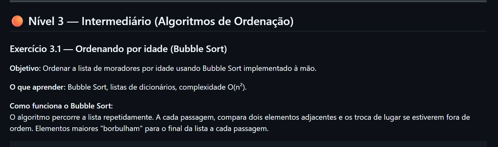
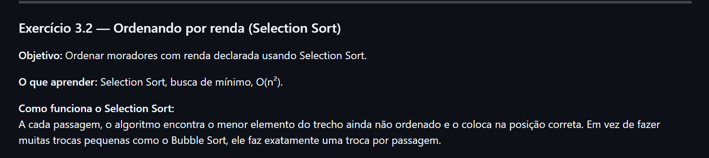
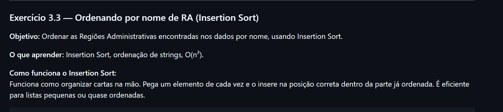
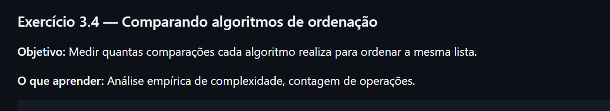
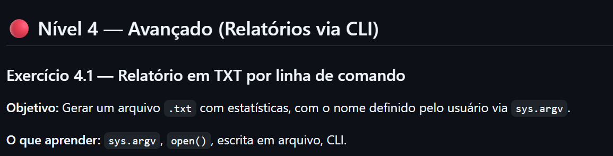

# 📅 Semana 12 — Continuação da análise da PDAD 2024 em ambiente local

Durante esta semana demos continuidade aos exercícios com os Microdados da PDAD 2024, retomando e refazendo atividades iniciadas na Semana 11. Desta vez, os códigos foram executados em ambiente local, utilizando o VS Code, para evitar as limitações e problemas de compatibilidade encontrados anteriormente no Jupyter Notebook.

## 📌 Conteúdos abordados

- Continuação dos exercícios da PDAD 2024
- Execução dos códigos em ambiente local
- Utilização do VS Code
- Manipulação de dados com Python
- Leitura e filtragem de arquivos
- Organização dos scripts e arquivos do projeto
- Correção e adaptação dos exercícios anteriores

## 🖥️ Ambiente utilizado

### VS Code

Nesta semana foi utilizado o VS Code como ambiente principal para execução dos códigos em Python o arquivo está na pasta dessa semana, assim como os datafremes utilizados na análise dos dados.

<p style="text-align: center;">
  
</p>

---

## 📊 Continuação dos exercícios da PDAD 2024

Nesta etapa foram retomados os exercícios da Semana 11, buscando corrigir problemas encontrados anteriormente e garantir a execução correta dos códigos em ambiente local.

## 🚀 Atividades redesenvolvidas

---

<p style="text-align: center;">
  
</p>

- Código da resolução

```python
import pandas as pd

moradores = pd.read_csv("semana12/moradores.csv", sep=";", decimal=",", encoding="utf-8-sig")
print(moradores.head())
print(moradores.shape)

```
Com isso sabemos que a planilha moradores.csv, possui 69542 linhas e 134 colunas

---

<p style="text-align: center;">
  
</p>

- Código da resolução

```python
import pandas as pd

moradores = pd.read_csv("semana12/moradores.csv", sep=";", decimal=",", encoding="utf-8-sig")

colunas = ["morador_id", "localidade", "idade_calculada", "id_genero", "escolaridade", "renda_ind", "peso_mor",]
print(moradores[colunas])
```

---

<p style="text-align: center;">
  
</p>

- Código da resolução

```python
import pandas as pd

domicilios = pd.read_excel("semana12/domicilios (1).xlsx")

mais = 0
mais1 = 0
ficha = 0
ficha2 = 0

for _, linha in domicilios.iterrows():
    if linha['A01npessoas'] > mais:
        mais = linha['A01npessoas']
        ficha = linha['A01nficha']
    if linha['A01ncriancas'] > mais1:
        mais1 = linha['A01ncriancas']
        ficha2 = linha['A01nficha']
print(f"Domicílio {ficha} tem a maior quantidade de moradores: {mais}")
print(f"Domicílio {ficha2} tem a maior quantidade de crianças: {mais1}")
```
Com esse código tambem conseguimos saber o domicilio com maior quantidades de crianças e de Moradores.
- Domicílio 5108 tem a maior quantidade de moradores: 14
- Domicílio 5108 tem a maior quantidade de crianças: 11

---

<p style="text-align: center;">
  
</p>

- Código da resolução

```python
import pandas as pd

moradores = pd.read_csv("semana12/moradores.csv", sep=";", decimal=",", encoding="utf-8-sig")

adultos = moradores[moradores["idade_calculada"] == 99999] # ou != 99999 para saber as idades validas
print(adultos[["morador_id", "idade_calculada"]])

```

- com esse código sabemos quantos moradores tem a idade declarada (69542)
- fazendo algumas alterações sabemos quantos que tem a idade declarada como 99999 e adianto que nenhum
- as Pessoas que teriam a idade como 999 seria aquela que não informaram 

---

<p style="text-align: center;">
  
</p>

- Código da resolução
```python
import pandas as pd

moradores = pd.read_csv("semana12/moradores.csv", sep=";", decimal=",", encoding="utf-8-sig")

idades = moradores[moradores["idade_calculada"] != 99999]["idade_calculada"].tolist()

c = 0
soma = 0
maximo = 0
minimo = 0
ficha = None
ficha2 = None

for idade in idades:
    if idade > maximo:
        maximo = idade
    if c < 1:
        minimo = idade
    else:
        if idade > 0 and idade < minimo:
            minimo = idade
    c = c + 1
    soma = soma + idade

media = soma / len(idades)
print(f"Total de moradores com idade declarada: {len(idades)}")
print(f"Soma das idades: {soma}")
print(f"Média de idade: {media:.1f} anos")
print(f'Morador com maior idade tem {maximo} anos')
print(f'Morador com menor idade tem {minimo} anos')
```
- Com esse código sabemos total de moradores com idade calculada, soma das idades, media das idade e a idade do morador mais velho e a idade do mais novo

---

<p style="text-align: center;">
  
</p>

- Código da resolução
```python

import pandas as pd

moradores = pd.read_csv("semana12/moradores.csv", sep=";", decimal=",", encoding="utf-8-sig")

escolaridade_nome = {
    1: "Sem instrução",
    2: "Fundamental incompleto",
    3: "Fundamental completo",
    4: "Médio incompleto",
    5: "Médio completo",
    6: "Superior incompleto",
    7: "Superior completo",
    8: "Sem classificação",
}

contagem = {}
for _, linha in moradores.iterrows():
    nivel = linha["escolaridade"]
    if nivel in escolaridade_nome:
        if nivel not in contagem:
            contagem[nivel] = 0
        contagem[nivel] += 1

print("Escolaridade dos moradores:")
for nivel, total in contagem.items():
    print(f"  {escolaridade_nome[nivel]}: {total} moradores")
```

- com esse código sabemos o nivel de escolaridade dos moradores, e o nivel mais comum é nivel médio completo

---

<p style="text-align: center;">
  
</p>

- Código da resolução
```python
import pandas as pd

moradores = pd.read_csv("semana12/moradores.csv", sep=";", decimal=",", encoding="utf-8-sig")

ra_alvo = 5320  # Gama

filtro = moradores[moradores["localidade"] == ra_alvo]

print(f"Moradores da RA {ra_alvo}:")
for _, linha in filtro.iterrows():
    print(f"  {linha['morador_id']} — {linha['idade_calculada']} anos — escolaridade: {linha['escolaridade']}")
```

- Com esse código vemos os moradores da RA gama, a idade, e a escolaridade

---

<p style="text-align: center;">
  
</p>

- Código da resolução
```python
import pandas as pd

moradores = pd.read_csv("semana12/moradores.csv", sep=";", decimal=",", encoding="utf-8-sig")

com_renda = moradores[(moradores["renda_ind"] > 0) & (moradores["renda_ind"] != 99999)]

soma = 0

print(f"Moradores com renda declarada: {len(com_renda)}")
for _, linha in com_renda.iterrows():
    soma += linha['renda_ind']
    print(f"  {linha['morador_id']} — R$ {linha['renda_ind']:,.0f}")
print(f'A média de salário dos valores é R$ {soma/len(com_renda):.2f}')
```

- Com esse código vemos os salários dos moradores e as médias saláriais

---


<p style="text-align: center;">
  
</p>

- Código da resolução
```python
n = len(lista)
soma = 0
for i in range(n):
    for j in range(n - i - 1):
        if lista[j]["idade_calculada"] > lista[j + 1]["idade_calculada"]:
            lista[j], lista[j + 1] = lista[j + 1], lista[j]

print("Moradores ordenados do mais novo ao mais velho:")
for m in lista:
    soma += 1
    print(f"  {m['morador_id']}: {m['idade_calculada']} anos")
print(f'Total de trocas para ordenar do menor para o maior {soma} vezes')
```

- Com esse código vemos as idades ordenadas do menor para o maior,

OBS: Tive que limitar a lista com as iformações do datafreme já que com a quantidade de linhas que possui o metodo Bubble sort trava.

---

<p style="text-align: center;">
  
</p>


- Código da resolução
```python

import pandas as pd

moradores = pd.read_csv("semana12/moradores.csv", sep=";", decimal=",", encoding="utf-8-sig")

com_renda = moradores[(moradores["renda_ind"] > 0) & (moradores["renda_ind"] != 99999)].copy()
lista = com_renda[["morador_id", "renda_ind", "escolaridade",]].head(450).to_dict("records")

# Selection Sort por renda (crescente)
n = len(lista)
for i in range(n):
    idx_min = i
    for j in range(i + 1, n):
        if lista[j]["renda_ind"] > lista[idx_min]["renda_ind"]:
            idx_min = j
    lista[i], lista[idx_min] = lista[idx_min], lista[i]

print("Moradores ordenados por renda (maior para menor):")
for m in lista:
    print(f"  {m['morador_id']}: R$ {m['renda_ind']:,.0f}, e nivel de escolaridade {m['escolaridade']}")
```

- Com esse código vemos a renda dos moradores do maior para o menor e a escolaridade

obs: Tambem limitamos a execução para os primeiro 450 dados, utilizando o metodo de ordenação Selection Sort

---

<p style="text-align: center;">
  
</p>

- Código da resolução
```python
import pandas as pd

moradores = pd.read_csv(
    "semana12/moradores.csv",
    sep=";",
    decimal=",",
    encoding="utf-8-sig"
)

ra_nomes = {
    5249: "Arniqueira",
    5301: "Brasília",
    5303: "Taguatinga",
    5305: "Sobradinho",
    5311: "Cruzeiro",
    5313: "Ceilândia",
    5314: "Sobradinho II",
    5315: "Jardim Botânico",
    5319: "Lago Sul",
    5320: "Gama",
    5326: "Samambaia",
    5328: "Santa Maria",
    5330: "São Sebastião",
}

# Obtém os códigos das RAs
codigos = moradores["localidade"].unique().tolist()

# Cria lista de RAs
ras = [{"codigo": c, "nome": ra_nomes.get(c, f"RA-{c}")} for c in codigos]

# Insertion Sort por nome
for i in range(1, len(ras)):
    chave = ras[i]
    j = i - 1

    while j >= 0 and ras[j]["nome"] > chave["nome"]:
        ras[j + 1] = ras[j]
        j -= 1

    ras[j + 1] = chave

print("Regiões Administrativas (ordem alfabética):")

for ra in ras:

    moradores_ra = moradores[
        (moradores["localidade"] == ra["codigo"]) &
        (moradores["idade_calculada"] != 99999)
    ]

    total = len(moradores_ra)

    media_idade = moradores_ra["idade_calculada"].mean()

    print(
        f"  {ra['nome']} - média de idade: {media_idade:.1f} anos "
        f"(cód. {ra['codigo']}): {total} moradores na amostra"
    )
```

- Com esse codigo vemos as RA por seus nomes e a média de idade daquela RA


---


<p style="text-align: center;">
  
</p>


- Código da resolução
```python
import pandas as pd

moradores = pd.read_csv( "semana12/moradores.csv", sep=";" , decimal="," , encoding="utf-8-sig")

validos = moradores[moradores["idade_calculada"] != 99999].copy()

# Limita todos os métodos aos primeiros 150 dados válidos
idades_base = validos["idade_calculada"].head(150).tolist()

def bubble_sort_conta(lista):
    lst = lista[:]
    comparacoes = 0
    n = len(lst)

    for i in range(n):
        for j in range(n - i - 1):
            comparacoes += 1
            if lst[j] > lst[j + 1]:
                lst[j], lst[j + 1] = lst[j + 1], lst[j]

    return lst, comparacoes


def selection_sort_conta(lista):
    lst = lista[:]
    comparacoes = 0
    n = len(lst)

    for i in range(n):
        idx_min = i

        for j in range(i + 1, n):
            comparacoes += 1
            if lst[j] < lst[idx_min]:
                idx_min = j

        lst[i], lst[idx_min] = lst[idx_min], lst[i]

    return lst, comparacoes


def insertion_sort_conta(lista):
    lst = lista[:]
    comparacoes = 0

    for i in range(1, len(lst)):
        chave = lst[i]
        j = i - 1

        while j >= 0 and lst[j] > chave:
            comparacoes += 1
            lst[j + 1] = lst[j]
            j -= 1

        if j >= 0:
            comparacoes += 1

        lst[j + 1] = chave

    return lst, comparacoes


n = len(idades_base)

_, c_bubble = bubble_sort_conta(idades_base)
_, c_selection = selection_sort_conta(idades_base)
_, c_insertion = insertion_sort_conta(idades_base)

print(f"Ordenando {n} elementos (idades dos moradores):")
print(f"  Bubble Sort:    {c_bubble} comparações")
print(f"  Selection Sort: {c_selection} comparações")
print(f"  Insertion Sort: {c_insertion} comparações")
print(f"  Teórico O(n²):  {n*n}  (n={n}, n²={n}²)")
```

- Com esse código podemos ver qual método se encaixar melhor ao organizar os dados, limitados a 150 linhas

---


<p style="text-align: center;">
  
</p>


- Código da resolução
```python
# relatorio_moradores.py
import sys
import pandas as pd

if len(sys.argv) < 2:
    print("Uso: python relatorio_moradores.py <nome_do_arquivo.txt>")
    sys.exit(1)

arquivo_saida = sys.argv[1]

moradores = pd.read_csv("semana12/moradores.csv", sep=";", decimal=",", encoding="utf-8-sig")
validos = moradores[moradores["idade_calculada"] != 99999]
idades = validos["idade_calculada"].tolist()
media_idade = sum(idades) / len(idades)

linhas = []
linhas.append("=" * 50)
linhas.append("RELATÓRIO PDAD 2024 — MORADORES")
linhas.append("=" * 50)
linhas.append(f"Total de moradores na amostra : {len(moradores)}")
linhas.append(f"Com idade declarada           : {len(validos)}")
linhas.append(f"Média de idade                : {media_idade:.1f} anos")
linhas.append(f"Idade mínima                  : {min(idades)} anos")
linhas.append(f"Idade máxima                  : {max(idades)} anos")
linhas.append("")

with open(arquivo_saida, "w", encoding="utf-8") as f:
    for linha in linhas:
        f.write(linha + "\n")

print(f"Relatório salvo em: {arquivo_saida}")
```


obs: após executar o programa, jogue essa instrução no teminal - python exolorando-pdad2024_E.py relatorio_moradores.tx, para executar o programa e gerar o relatório


---


<p style="text-align: center;">
  
</p>

- Código da resolução
```python
# analise_ra.py
import sys
import pandas as pd

RA_NOMES = {
    5249: "Arniqueira",    5301: "Brasília",       5303: "Taguatinga",
    5305: "Sobradinho",    5311: "Cruzeiro",        5313: "Ceilândia",
    5314: "Sobradinho II", 5315: "Jardim Botânico", 5319: "Lago Sul",
    5320: "Gama",          5326: "Samambaia",       5328: "Santa Maria",
    5330: "São Sebastião",
}

ESCOLARIDADE = {1:"Sem instrução",2:"Fund. incompleto",3:"Fund. completo",
                4:"Médio incompleto",5:"Médio completo",6:"Superior incompleto",
                7:"Superior completo",8:"Pós-graduação"}

def bubble_sort_por_idade(lista):
    n = len(lista)
    for i in range(n):
        for j in range(n - i - 1):
            if lista[j]["idade"] > lista[j + 1]["idade"]:
                lista[j], lista[j + 1] = lista[j + 1], lista[j]
    return lista

def gerar_relatorio(ra_codigo):
    moradores = pd.read_csv("semana12/moradores.csv", sep=";", decimal=",", encoding="utf-8-sig")
    filtro = moradores[moradores["localidade"] == ra_codigo]

    if filtro.empty:
        print(f"Nenhum dado encontrado para a RA {ra_codigo}.")
        sys.exit(1)

    ra_nome = RA_NOMES.get(ra_codigo, f"RA-{ra_codigo}")
    validos = filtro[filtro["idade_calculada"] != 99999]
    idades = validos["idade_calculada"].tolist()

    lista_moradores = []
    for _, linha in validos.iterrows():
        lista_moradores.append({
            "id": linha["morador_id"],
            "idade": linha["idade_calculada"],
            "escolaridade": ESCOLARIDADE.get(linha["escolaridade"], "?"),
            "renda": linha["renda_ind"] if linha["renda_ind"] != 99999 else None,
        })
    lista_moradores = bubble_sort_por_idade(lista_moradores)

    linhas = []
    linhas.append("=" * 55)
    linhas.append(f"  PDAD 2024 — Análise da RA: {ra_nome} (cód. {ra_codigo})")
    linhas.append("=" * 55)
    linhas.append(f"  Total de moradores na amostra : {len(filtro)}")
    linhas.append(f"  Com idade declarada           : {len(validos)}")
    if idades:
        linhas.append(f"  Média de idade                : {sum(idades)/len(idades):.1f} anos")
        linhas.append(f"  Faixa etária                  : {min(idades)} a {max(idades)} anos")
    linhas.append("")
    linhas.append("  Moradores (ordenados por idade):")
    linhas.append("  " + "-" * 50)
    for m in lista_moradores:
        renda_str = f"R$ {m['renda']:,.0f}" if m["renda"] else "não declarada"
        linhas.append(f"  {m['id']:12s} | {m['idade']:3d} anos | {m['escolaridade']:25s} | {renda_str}")
    linhas.append("")
    return linhas, ra_nome

if len(sys.argv) < 2:
    print("Uso: python analise_ra.py <codigo_ra> [arquivo_saida.txt]")
    print("Exemplo: python analise_ra.py 5320")
    print("Exemplo: python analise_ra.py 5320 relatorio_gama.txt")
    sys.exit(1)

ra = int(sys.argv[1])
linhas, nome = gerar_relatorio(ra)

for linha in linhas:
    print(linha)

if len(sys.argv) >= 3:
    with open(sys.argv[2], "w", encoding="utf-8") as f:
        for linha in linhas:
            f.write(linha + "\n")
    print(f"\n  Relatório salvo em: {sys.argv[2]}")
```