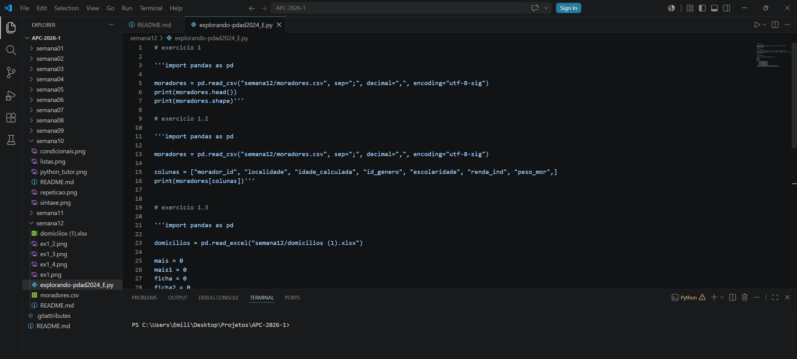

# 📅 Semana 12 — Continuação da análise da PDAD 2024 em ambiente local

Durante esta semana demos continuidade aos exercícios com os Microdados da PDAD 2024, retomando e refazendo atividades iniciadas na Semana 11. Desta vez, os códigos foram executados em ambiente local, utilizando o VS Code, para evitar as limitações e problemas de compatibilidade encontrados anteriormente no Jupyter Notebook.

## 📌 Conteúdos abordados

- Continuação dos exercícios da PDAD 2024
- Execução dos códigos em ambiente local
- Utilização do VS Code
- Manipulação de dados com Python
- Leitura e filtragem de arquivos
- Organização dos scripts e arquivos do projeto
- Correção e adaptação dos exercícios anteriores

## 🖥️ Ambiente utilizado

### VS Code

Nesta semana foi utilizado o VS Code como ambiente principal para execução dos códigos em Python o arquivo está na pasta dessa semana, assim como os datafremes utilizados na análise dos dados.

<p style="text-align: center;">
  
</p>

---

## 📊 Continuação dos exercícios da PDAD 2024

Nesta etapa foram retomados os exercícios da Semana 11, buscando corrigir problemas encontrados anteriormente e garantir a execução correta dos códigos em ambiente local.

## 🚀 Atividades redesenvolvidas

---

<p style="text-align: center;">
  
</p>

- Código da resolução

```python
import pandas as pd

moradores = pd.read_csv("semana12/moradores.csv", sep=";", decimal=",", encoding="utf-8-sig")
print(moradores.head())
print(moradores.shape)

```
Com isso sabemos que a planilha moradores.csv, possui 69542 linhas e 134 colunas

---

<p style="text-align: center;">
  
</p>

- Código da resolução

```python
import pandas as pd

moradores = pd.read_csv("semana12/moradores.csv", sep=";", decimal=",", encoding="utf-8-sig")

colunas = ["morador_id", "localidade", "idade_calculada", "id_genero", "escolaridade", "renda_ind", "peso_mor",]
print(moradores[colunas])
```

---

<p style="text-align: center;">
  
</p>

- Código da resolução

```python
import pandas as pd

domicilios = pd.read_excel("semana12/domicilios (1).xlsx")

mais = 0
mais1 = 0
ficha = 0
ficha2 = 0

for _, linha in domicilios.iterrows():
    if linha['A01npessoas'] > mais:
        mais = linha['A01npessoas']
        ficha = linha['A01nficha']
    if linha['A01ncriancas'] > mais1:
        mais1 = linha['A01ncriancas']
        ficha2 = linha['A01nficha']
print(f"Domicílio {ficha} tem a maior quantidade de moradores: {mais}")
print(f"Domicílio {ficha2} tem a maior quantidade de crianças: {mais1}")
```
Com esse código tambem conseguimos saber o domicilio com maior quantidades de crianças e de Moradores.
- Domicílio 5108 tem a maior quantidade de moradores: 14
- Domicílio 5108 tem a maior quantidade de crianças: 11

---

<p style="text-align: center;">
  
</p>