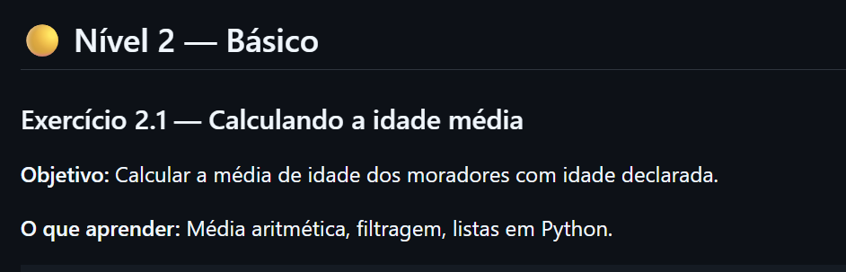
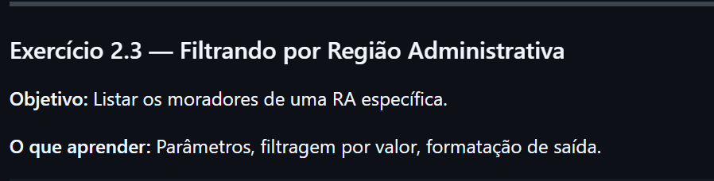

# 📅 Semana 12 — Continuação da análise da PDAD 2024 em ambiente local

Durante esta semana demos continuidade aos exercícios com os Microdados da PDAD 2024, retomando e refazendo atividades iniciadas na Semana 11. Desta vez, os códigos foram executados em ambiente local, utilizando o VS Code, para evitar as limitações e problemas de compatibilidade encontrados anteriormente no Jupyter Notebook.

## 📌 Conteúdos abordados

- Continuação dos exercícios da PDAD 2024
- Execução dos códigos em ambiente local
- Utilização do VS Code
- Manipulação de dados com Python
- Leitura e filtragem de arquivos
- Organização dos scripts e arquivos do projeto
- Correção e adaptação dos exercícios anteriores

## 🖥️ Ambiente utilizado

### VS Code

Nesta semana foi utilizado o VS Code como ambiente principal para execução dos códigos em Python o arquivo está na pasta dessa semana, assim como os datafremes utilizados na análise dos dados.

<p style="text-align: center;">
  
</p>

---

## 📊 Continuação dos exercícios da PDAD 2024

Nesta etapa foram retomados os exercícios da Semana 11, buscando corrigir problemas encontrados anteriormente e garantir a execução correta dos códigos em ambiente local.

## 🚀 Atividades redesenvolvidas

---

<p style="text-align: center;">
  
</p>

- Código da resolução

```python
import pandas as pd

moradores = pd.read_csv("semana12/moradores.csv", sep=";", decimal=",", encoding="utf-8-sig")
print(moradores.head())
print(moradores.shape)

```
Com isso sabemos que a planilha moradores.csv, possui 69542 linhas e 134 colunas

---

<p style="text-align: center;">
  
</p>

- Código da resolução

```python
import pandas as pd

moradores = pd.read_csv("semana12/moradores.csv", sep=";", decimal=",", encoding="utf-8-sig")

colunas = ["morador_id", "localidade", "idade_calculada", "id_genero", "escolaridade", "renda_ind", "peso_mor",]
print(moradores[colunas])
```

---

<p style="text-align: center;">
  
</p>

- Código da resolução

```python
import pandas as pd

domicilios = pd.read_excel("semana12/domicilios (1).xlsx")

mais = 0
mais1 = 0
ficha = 0
ficha2 = 0

for _, linha in domicilios.iterrows():
    if linha['A01npessoas'] > mais:
        mais = linha['A01npessoas']
        ficha = linha['A01nficha']
    if linha['A01ncriancas'] > mais1:
        mais1 = linha['A01ncriancas']
        ficha2 = linha['A01nficha']
print(f"Domicílio {ficha} tem a maior quantidade de moradores: {mais}")
print(f"Domicílio {ficha2} tem a maior quantidade de crianças: {mais1}")
```
Com esse código tambem conseguimos saber o domicilio com maior quantidades de crianças e de Moradores.
- Domicílio 5108 tem a maior quantidade de moradores: 14
- Domicílio 5108 tem a maior quantidade de crianças: 11

---

<p style="text-align: center;">
  
</p>

- Código da resolução

```python
import pandas as pd

moradores = pd.read_csv("semana12/moradores.csv", sep=";", decimal=",", encoding="utf-8-sig")

adultos = moradores[moradores["idade_calculada"] == 99999] # ou != 99999 para saber as idades validas
print(adultos[["morador_id", "idade_calculada"]])

```

- com esse código sabemos quantos moradores tem a idade declarada (69542)
- fazendo algumas alterações sabemos quantos que tem a idade declarada como 99999 e adianto que nenhum
- as Pessoas que teriam a idade como 999 seria aquela que não informaram 

---

<p style="text-align: center;">
  
</p>

- Código da resolução
```python
import pandas as pd

moradores = pd.read_csv("semana12/moradores.csv", sep=";", decimal=",", encoding="utf-8-sig")

idades = moradores[moradores["idade_calculada"] != 99999]["idade_calculada"].tolist()

c = 0
soma = 0
maximo = 0
minimo = 0
ficha = None
ficha2 = None

for idade in idades:
    if idade > maximo:
        maximo = idade
    if c < 1:
        minimo = idade
    else:
        if idade > 0 and idade < minimo:
            minimo = idade
    c = c + 1
    soma = soma + idade

media = soma / len(idades)
print(f"Total de moradores com idade declarada: {len(idades)}")
print(f"Soma das idades: {soma}")
print(f"Média de idade: {media:.1f} anos")
print(f'Morador com maior idade tem {maximo} anos')
print(f'Morador com menor idade tem {minimo} anos')
```
- Com esse código sabemos total de moradores com idade calculada, soma das idades, media das idade e a idade do morador mais velho e a idade do mais novo

---

<p style="text-align: center;">
  
</p>

- Código da resolução
```python

import pandas as pd

moradores = pd.read_csv("semana12/moradores.csv", sep=";", decimal=",", encoding="utf-8-sig")

escolaridade_nome = {
    1: "Sem instrução",
    2: "Fundamental incompleto",
    3: "Fundamental completo",
    4: "Médio incompleto",
    5: "Médio completo",
    6: "Superior incompleto",
    7: "Superior completo",
    8: "Sem classificação",
}

contagem = {}
for _, linha in moradores.iterrows():
    nivel = linha["escolaridade"]
    if nivel in escolaridade_nome:
        if nivel not in contagem:
            contagem[nivel] = 0
        contagem[nivel] += 1

print("Escolaridade dos moradores:")
for nivel, total in contagem.items():
    print(f"  {escolaridade_nome[nivel]}: {total} moradores")
```

- com esse código sabemos o nivel de escolaridade dos moradores, e o nivel mais comum é nivel médio completo

---

<p style="text-align: center;">
  
</p>

- Código da resolução
```python
import pandas as pd

moradores = pd.read_csv("semana12/moradores.csv", sep=";", decimal=",", encoding="utf-8-sig")

ra_alvo = 5320  # Gama

filtro = moradores[moradores["localidade"] == ra_alvo]

print(f"Moradores da RA {ra_alvo}:")
for _, linha in filtro.iterrows():
    print(f"  {linha['morador_id']} — {linha['idade_calculada']} anos — escolaridade: {linha['escolaridade']}")
```

- Com esse código vemos os moradores da RA gama, a idade, e a escolaridade

---

<p style="text-align: center;">
  
</p>

- Código da resolução
```python
import pandas as pd

moradores = pd.read_csv("semana12/moradores.csv", sep=";", decimal=",", encoding="utf-8-sig")

com_renda = moradores[(moradores["renda_ind"] > 0) & (moradores["renda_ind"] != 99999)]

soma = 0

print(f"Moradores com renda declarada: {len(com_renda)}")
for _, linha in com_renda.iterrows():
    soma += linha['renda_ind']
    print(f"  {linha['morador_id']} — R$ {linha['renda_ind']:,.0f}")
print(f'A média de salário dos valores é R$ {soma/len(com_renda):.2f}')
```

- Com esse código vemos os salários dos moradores e a média salarias

---