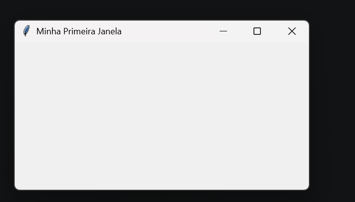
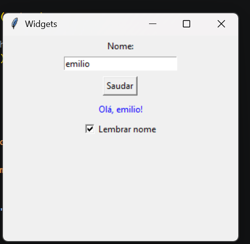

# 📅 Semana 13 — Introdução a Interfaces Gráficas com Tkinter

Durante esta semana foi realizado o primeiro contato com o desenvolvimento de interfaces gráficas utilizando a biblioteca Tkinter, que faz parte da biblioteca padrão do Python. Foram criadas janelas simples e explorados os principais componentes gráficos utilizados para interação com o usuário.

## 📌 Conteúdos abordados

- Introdução ao Tkinter
- Criação de janelas gráficas
- Configuração de propriedades da janela
- Utilização de widgets
- Campos de entrada de texto
- Botões e eventos
- Exibição dinâmica de informações
- Interação entre usuário e programa

## 🌐 Ferramenta utilizada

### Tkinter

Biblioteca gráfica nativa do Python utilizada para construção de interfaces gráficas.

---

## 🚀 Atividades desenvolvidas

### 🖥️ Criação da primeira janela

Foi criada uma janela básica utilizando a classe `Tk()`, configurando título, dimensões e o loop principal responsável pelo funcionamento da interface.

<p style="text-align: center;">
  
</p>


### 💻 Exemplo de código

```python
import tkinter as tk

janela = tk.Tk()

janela.title("Minha Primeira Janela")
janela.geometry("400x200")
janela.mainloop()
```

### 💡 Reflexão

Esta atividade representou o primeiro contato com o desenvolvimento de interfaces gráficas utilizando Python. Foi possível compreender como criar uma janela básica, configurar suas propriedades e iniciar o ciclo de execução da aplicação através do método `mainloop()`. Apesar de simples, o exercício mostrou a diferença entre programas executados apenas no terminal e aplicações com elementos visuais, servindo como base para a construção de interfaces mais completas nas próximas atividades.


---

### 🖥️ Exercício — Utilização de Widgets

Nesta atividade foram utilizados alguns dos principais componentes da biblioteca Tkinter para construção de interfaces gráficas. O programa permite que o usuário digite seu nome em um campo de texto e, ao clicar em um botão, uma mensagem personalizada seja exibida na tela. Também foi utilizada uma caixa de seleção (*Checkbutton*) para demonstrar componentes de interação.

<p style="text-align: center;">
  
</p>


### 💻 Exemplo de código

```python
import tkinter as tk

janela = tk.Tk()
janela.title("Widgets")
janela.geometry("320x280")

# Label — texto estático
tk.Label(janela, text="Nome:").pack(pady=4)

# Entry — campo de texto de uma linha
entrada = tk.Entry(janela, width=25)
entrada.pack()

# Button — botão clicável
def saudar():
    nome = entrada.get()
    resultado.config(text=f"Olá, {nome}!")

tk.Button(janela, text="Saudar", command=saudar).pack(pady=8)

# Label que muda dinamicamente
resultado = tk.Label(janela, text="", fg="blue")
resultado.pack()

# Checkbutton — caixa de seleção
var = tk.BooleanVar()
tk.Checkbutton(janela, text="Lembrar nome", variable=var).pack(pady=4)

janela.mainloop()
```

### 💡 Reflexão

Este exercício permitiu compreender como os elementos visuais de uma interface gráfica interagem com o código Python. Foi possível observar como eventos, como o clique de um botão, podem modificar dinamicamente informações exibidas na tela, tornando os programas mais interativos e amigáveis para o usuário.