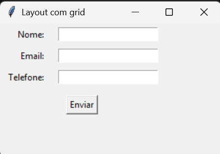
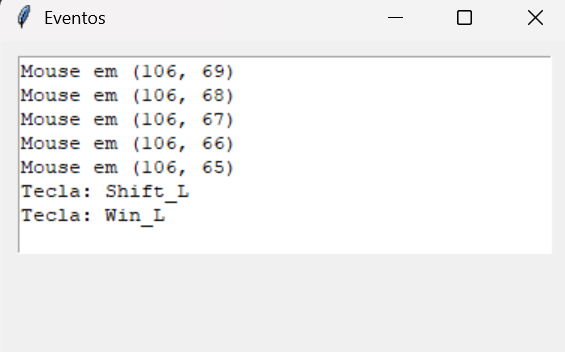
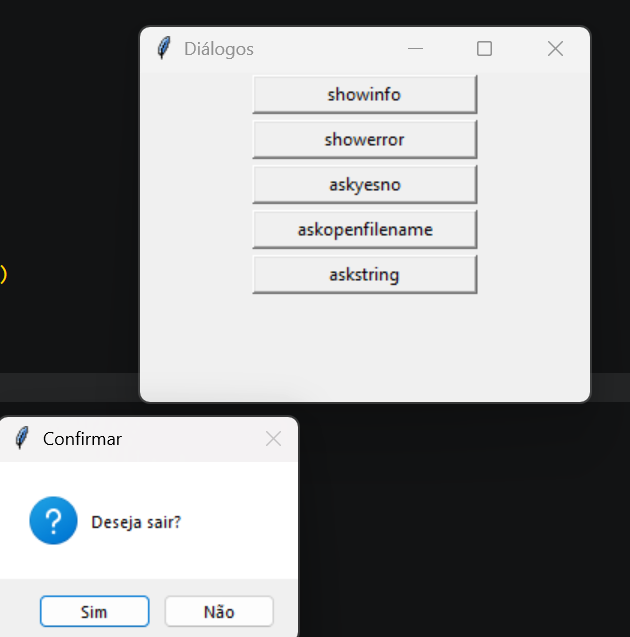

# 📅 Semana 14 — Continuação do desenvolvimento de interfaces gráficas com Tkinter

Nesta semana foram aprofundados os conceitos de desenvolvimento de interfaces gráficas utilizando a biblioteca Tkinter. Foram exploradas novas formas de organização dos componentes da interface, tratamento de eventos e utilização de caixas de diálogo para interação com o usuário.

## 📌 Conteúdos abordados

- Gerenciador de layout `grid()`
- Organização de componentes em linhas e colunas
- Tratamento de eventos com `bind()`
- Captura de eventos do teclado e do mouse
- Utilização de caixas de diálogo
- Mensagens de informação e erro
- Seleção de arquivos
- Entrada de dados por meio de diálogos

## 🌐 Biblioteca utilizada

### Tkinter

Biblioteca gráfica nativa do Python utilizada para criação de interfaces gráficas.

---

## 🚀 Atividades desenvolvidas

### 📋 Organização de interfaces com Grid

Foi utilizada a função `grid()` para organizar os componentes da interface em linhas e colunas, permitindo criar formulários de forma mais organizada e intuitiva. 

<p style="text-align: center;">
  
</p>

### 💻 Exemplo de código

```python
import tkinter as tk

janela = tk.Tk()
janela.title("Layout com grid")
janela.geometry("300x180")

# grid organiza em linhas e colunas
campos = ["Nome", "Email", "Telefone"]
entradas = {}

for i, campo in enumerate(campos):
    tk.Label(janela, text=campo + ":").grid(
        row=i, column=0, sticky="e", padx=8, pady=4
    )
    e = tk.Entry(janela, width=22)
    e.grid(row=i, column=1, padx=8)
    entradas[campo] = e

# sticky="e" alinha o Label à direita (East)
# columnspan junta colunas
tk.Button(janela, text="Enviar").grid(
    row=len(campos), column=0, columnspan=2, pady=10
)

janela.mainloop()

```

### 💡 Reflexão

A utilização do `grid()` mostrou uma forma mais organizada de posicionar elementos na tela quando comparada ao método `pack()`. Esse gerenciador de layout facilita a construção de formulários e interfaces mais estruturadas.

---

## 🖱️ Tratamento de eventos

Nesta atividade foi utilizado o método `bind()` para capturar eventos do teclado e do mouse, permitindo que a aplicação responda às ações realizadas pelo usuário.

<p style="text-align: center;">
  
</p>

### 💻 Exemplo de código

```python
import tkinter as tk

janela = tk.Tk()

def tecla(evento):
    print(evento.keysym)

janela.bind("<Key>", tecla)

janela.mainloop()
```

### 💡 Reflexão

Foi possível compreender como aplicações gráficas respondem às ações do usuário através de eventos. O uso do `bind()` tornou possível capturar cliques do mouse e pressionamentos de teclas, tornando os programas mais interativos.

---

## 💬 Caixas de diálogo

Também foram exploradas as principais caixas de diálogo disponíveis no Tkinter, como mensagens de informação, mensagens de erro, confirmação, seleção de arquivos e entrada de texto pelo usuário. :contentReference[oaicite:2]{index=2}

<p style="text-align: center;">
  
</p>

### 💻 Exemplo de código

```python
from tkinter import messagebox

messagebox.showinfo("Informação", "Operação concluída!")
```

### 💡 Reflexão

As caixas de diálogo facilitaram a comunicação entre o programa e o usuário, permitindo exibir mensagens, solicitar confirmações e receber informações de forma simples e intuitiva.

---

## 🧠 Conclusão

Nesta semana foram aprofundados os conhecimentos sobre desenvolvimento de interfaces gráficas utilizando a biblioteca Tkinter. Além da criação de janelas e widgets, foram estudadas técnicas para organizar componentes, capturar eventos do usuário e utilizar caixas de diálogo, ampliando as possibilidades de desenvolvimento de aplicações gráficas em Python.